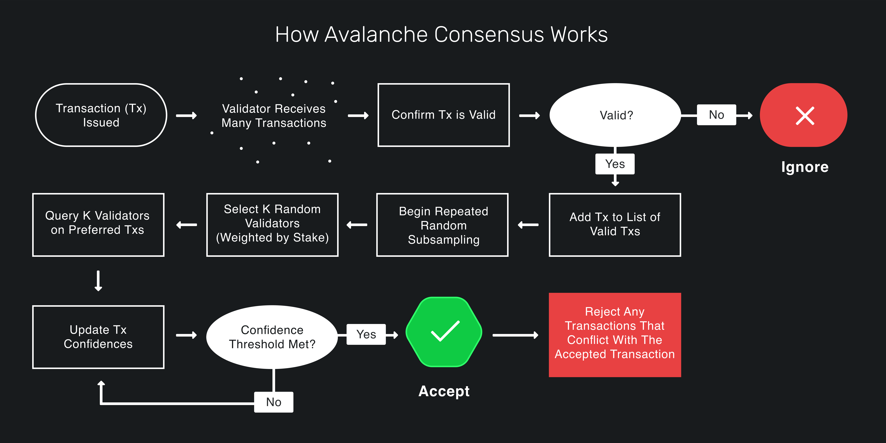

# Documentación para desarrolladores







































## Avalanche

[Avalanche](https://avax.network) es una plataforma de código abierto para el lanzamiento de [aplicaciones descentralizadas](https://support.avalabs.org/en/articles/4587146-what-is-a-decentralized-application-dapp) y despliegues de [blockchains](http://support.avalabs.org/en/articles/4064677-what-is-a-blockchain) empresariales en un ecosistema interoperable y altamente escalable. Avalanche te da un control completo tanto de la red como de las capas de aplicación, ayudándote a construir cualquier cosa que puedas imaginar

Una diferencia clave entre Avalanche y otras redes descentralizadas es el protocolo de consenso. Con el tiempo, la gente ha llegado a un falso entendimiento de que las blockchains tienen que ser lentas y no escalables. El protocolo de Avalanche emplea un novedoso enfoque de consenso para lograr sus sólidas garantías de seguridad, su rápida finalidad y su alto rendimiento, sin comprometer la descentralización.

## Token \(AVAX\) Avalanche

El token \(AVAX\) Avalanche es el token nativo de la plataforma Avalanche y se utiliza para proteger la red mediante el staking, realizar transacciones entre pares, pagar las comisiones, y proporcionar una unidad básica de cuenta entre las múltiples subredes creadas en la plataforma Avalanche. 1 nAVAX es igual a 0.000000001 AVAX.

## Protocolo de Consenso de Avalanche

Los protocolos en la familia Avalanche operan a través de repetidas votaciones sub-muestreadas. Cuando un [validador](http://support.avalabs.org/en/articles/4064704-what-is-a-blockchain-validator) está determinando si una [transacción](http://support.avalabs.org/en/articles/4587384-what-is-a-transaction) debe ser aceptada o rechazada, esta pregunta a un pequeño subconjunto aleatorio de validadores si creen que la transacción debe ser aceptada o rechazada. Si el validador consultado piensa que la transacción no es válida, ya la ha rechazado o prefiere una transacción conflictiva, responde que piensa que la transacción debe ser rechazada. En caso contrario, responde que cree que la transacción debería ser aceptada.

Si una parte suficientemente grande \(_alpha_ $$α$$\) de los validadores muestreados responde que cree que la transacción debe ser aceptada, el validador prefiere aceptar la transacción. Es decir, cuando se le pregunte sobre la transacción en el futuro, responderá que cree que la transacción debe ser aceptada. Del mismo modo, el validador preferirá rechazar la transacción si una parte suficientemente grande de los validadores responde que cree que la transacción debería ser rechazada.

El validador repite este proceso de muestreo hasta que _alpha_ de los validadores consultados responda de la misma manera \(aceptar o rechazar\) para _beta_ $$β$$ rondas consecutivas.

En el caso común de que una transacción no tenga conflictos, la finalización se produce muy rápidamente. Cuando existen conflictos, los validadores honestos se agrupan rápidamente en torno a las transacciones conflictivas, entrando en un bucle de retroalimentación positiva hasta que todos los validadores correctos prefieran esa transacción. Esto lleva a la aceptación de transacciones no conflictivas y al rechazo de las transacciones conflictivas.

Se garantiza \(con una alta probabilidad basada en los parámetros del sistema\) que si cualquier validador honesto acepta o rechaza una transacción, todos los validadores honestos aceptarán o rechazarán esa transacción.

Aprende más componentes técnicos del protocolo de consenso de Avalanche leyendo el [whitepaper](https://arxiv.org/pdf/1906.08936.pdf).

## Protocolo de Consenso Snowman

Snowman es un protocolo de consenso optimizado en cadena de alto rendimiento, totalmente ordenado, y genial para smart contracts. Snowman está impulsado por el [Protocolo de consenso de Avalanche](./#avalanche-consensus-protocol). Tanto la [P-Chain](aprende/platform-overview/#platform-chain-p-chain) como la [C-Chain](aprende/platform-overview/#contract-chain-c-chain) implementan el protocolo de consenso Snowman.

## Características principales

### Velocidad

Utiliza un novedoso protocolo de consenso, desarrollado por un equipo de informáticos de Cornell, y es capaz de confirmar permanentemente las transacciones en menos de 1 segundo.

### Escalabilidad

Con capacidad para 4 500 transacciones por segundo, un orden de magnitud mayor que las blockchains existentes.

### Seguridad

Asegura garantías de seguridad más fuertes, muy por encima del estándar del 51% de otras redes.

### Flexibilidad

Crea fácilmente blockchains personalizadas y aplicaciones descentralizadas que contengan casi cualquier lógica arbitraria.

### Sostenibilidad

Utiliza el algoritmo de consenso de eficiencia energética proof-of-stake en lugar de proof-of-work.

### Soporte de Smart Contracts

Permite la creación de smart contracts en Solidity y tus herramientas favoritas de Ethereum como Remix, Metamask, Truffle, y más.

### Blockchains Públicas y Privadas

Crea tus propias blockchains públicas o privadas.

### Diseñado para las finanzas

Soporte nativo para crear e intercambiar fácilmente activos digitales inteligentes con reglas complejas y personalizadas. 

