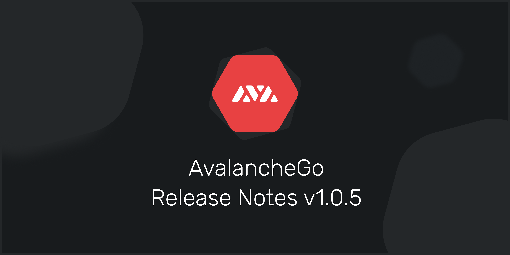

# Notas de Versión de AvalancheGo



## Notas de Versión de AvalancheGo v1.0.6 \([Ver en GitHub](https://github.com/ava-labs/avalanchego/releases/tag/v1.0.6)\)



Tenga en cuenta que este comunicado contiene cambios de última hora descritos [aquí](https://docs.avax.network/build/apis/deprecated-api-calls). Cambia el formato de respuesta por defecto de platform.getTxStatus y platform.getCurrentValidators. La actualización es opcional pero se recomienda. El parche incluye mejoras en el rendimiento y algunas mejoras en la calidad de vida.


* Se han eliminado los formatos obsoletos de platform.getTxStatus y platform.getCurrentValidators.
* Se añadió soporte para codificaciones hexadecimales de usuarios importados y exportados desde la API de keystore.
* Se ha establecido el requisito de golang a la v1.15.5 para evitar una vulnerabilidad de DoS encontrada en el estándar golang lib.
* Se han añadido clientes de la API para que actúen como ayudantes interactuando con el software del nodo.
* Se ha habilitado la posibilidad de volver al arranque si un nodo se desconecta del resto de la red.
* Arregladas las APIs de GetUTXOs cuando UTXOs referenciaba múltiples direcciones.
* Se refactorizó la codificación binaria para generalizar mejor las opciones de RPC.
* Se ha fijado el filtrado de bloque IP para establecer correctamente la longitud de la ventana.
* Se ha generalizado el paquete de códecs para poder manejar múltiples códecs con diferentes versiones.
* Se añadió Epoch a la interfaz Vertex en preparación de una futura versión.
* Se aplazó el hashing de las transacciones para reducir la utilización de la CPU/Memoria más allá de los chequeos rápidos.
* Para aquellos usando [https://explorerapi.avax-dev.network/](https://explorerapi.avax-dev.network/), la URL va a ser cerrada en un futuro lanzamiento. Por favor, cambiate a [https://explorerapi.avax.network/](https://explorerapi.avax.network/). 

Para ayuda con esta actualización ve a [Preguntas Frecuentes de los Desarrolladores](https://support.avalabs.org/en/collections/2618154-developer-faq), si todavía tienes problemas, puedes unirte a nuestro servidor de [Discord](https://chat.avax.network) para que te ayudemos.

## Notas de Versión de AvalancheGo v1.0.5 \([Ver en GitHub](https://github.com/ava-labs/avalanchego/releases/tag/v1.0.5)\)




Tenga en cuenta que la versión posterior a ésta, la v1.0.6, contendrá los cambios de última hora de descritos [aquí](https://docs.avax.network/build/apis/deprecated-api-calls). El formato de respuesta de  `platform.getTxStatus` y`platform.getCurrentValidators` cambiará.


Los cambios en esta versión, v1.0.5, son compatibles con versiones anteriores. La actualización es opcional pero se recomienda. El parche incluye mejoras en el rendimiento y algunas mejoras en la calidad de vida.

* Se añadió `IssueTx` y `GetUTXOs` a la API de la C-chain para permitir la emisión de intercambios atómicos sin revelar las claves privadas de un nodo.
* Se corregió la fuga de memoria en el gestor de peticiones de snowman con el procesamiento de bloques de oráculo.
* Se corregió el error de paginación de UTXO que no informaba sobre los fondos disponibles.
* Se han movido los registros de la cadena http a la carpeta de registros de la cadena legible por los humanos.
* Se ha reestructurado la forma en que se gestionan las ID para evitar las asignaciones de montones.
* Se optimizó el `UniformSampler` para evitar la creación de múltiples mapas.
* Se ha reducido el uso de `ids.Set` a favor de `[]ids.ID` para utilizar mejor la memoria continua.
* Se introdujo la reutilización de `[]byte` en `PrefixDB`.
* Se han implementado funciones de clasificación específicas de tipo para evitar asignaciones frecuentes de conversión de interfaz.
* Se ha optimizado el usuario de carga AVM para evitar leer información innecesaria del disco.
* Eliminada una asignación de memoria + copia en el envío de sockets para toda la longitud del mensaje.

Para ayuda con esta actualización ve a [Preguntas Frecuentes de los Desarrolladores](https://support.avalabs.org/en/collections/2618154-developer-faq), si todavía tienes problemas, puedes unirte a nuestro servidor de [Discord](https://chat.avax.network) para que te ayudemos.

## Notas de Versión de AvalancheGo v1.0.4 \([Ver en GitHub](https://github.com/ava-labs/avalanchego/releases/tag/v1.0.4)\)


Esta actualización es opcional pero se recomienda. El parche incluye mejoras en la calidad de vida y varias mejoras en el rendimiento. Tenga en cuenta que esta actualización requiere que los parámetros de la CLI se especifiquen con -- en lugar de permitir - o --. Por ejemplo, `-public-ip=127.0.0.1` ya no está permitido y debe especificarse como `--public-ip=127.0.0.1`. De resto, esta actualización es compatible con las versiones anteriores.

```text
• Added subnet whitelisting to allow a node owner to choose which subnets to validate.
• Added config file parsing for node settings.
• Added more options for specifying a node's IP address and added getNodeIP to the info *endpoint.
• Added a TxID to the result of get.Validators in the platformvm.
• Updated Coreth version.
• Cleaned up the snowball trie implementation and added additional tests to align with mutation tests.
• Implemented and optimized continuous time averages for tracking CPU and network latency.
• Significantly optimized memory allocations in various locations.
• Increased the signature verification cache size.
• Reduced DB reads during vertex management.
```

```text
• Added an optional argument includeReason to platform.getTxStatus.
If not provided, or if false, the output from getTxStatus is the same as before.

For example:
{
    "jsonrpc": "2.0",
    "result": "Dropped",
    "id": 1
}

If includeReason is true, the output from getTxStatus has a new format. It's an object that looks like this:

{
    "jsonrpc": "2.0",
    "result": {
        "status":"[Status]",
        "reason":"[Reason tx was dropped, if applicable]"
    },
    "id": 1
}

In this new format, reason will not be present unless the status is Dropped.
Anything that depends on platform.getTxStatus should switch to using the includeReason argument and use the new response format. After a few releases, we'll only support the new response format.
```

Para ayuda con esta actualización ve a [Preguntas Frecuentes de los Desarrolladores](https://support.avalabs.org/en/collections/2618154-developer-faq), si todavía tienes problemas, puedes unirte a nuestro servidor de [Discord](https://chat.avax.network) para que te ayudemos.

<!--stackedit_data:
eyJoaXN0b3J5IjpbLTE4NzE3NzI3MDksLTE4NDUwMzc2OTMsLT
EyNDg3NzUxNzZdfQ==
-->