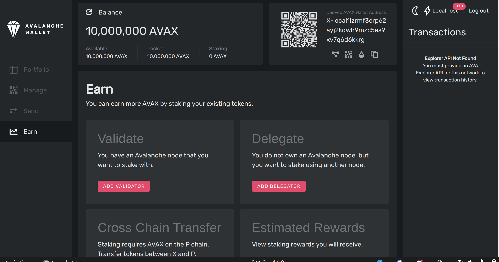
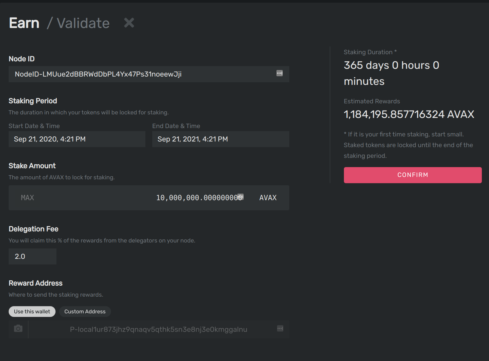
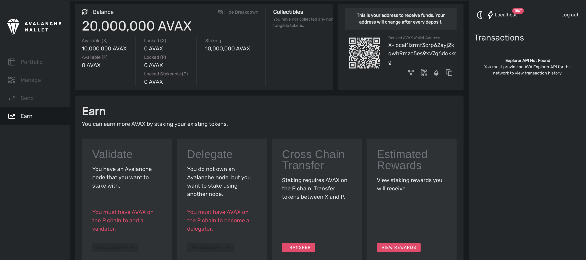
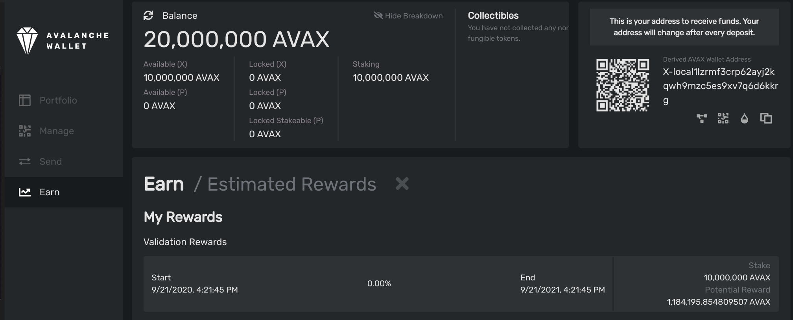

# [**Añadir un Validador**](https://stackedit.io/add-a-validator.md)

## Introducción

La [Red Principal](https://avalanche.gitbook.io/avalanche/build/tutorials/platform/add-a-validator#introduction) es propia de la plataforma de Avalanche y valida las [ blockchains incorporadas](https://avalanche.gitbook.io/avalanche/learn/platform-overview) de Avalanche. En este tutorial, añadiremos un nodo a la Red Principal y una [subnet](https://avalanche.gitbook.io/avalanche/learn/platform-overview#subnets) en Avalanche.

La P-Chain maneja los metadatos de Avalanche. Esto incluye el seguimiento de qué nodos están en qué subredes, que blockchains existen, y cuales subnets están validando cuales blockchains. Para añadir un validador, emitiremos [transacciones](http://support.avalabs.org/en/articles/4587384-what-is-a-transaction) a la P-Chain.


Tenga en cuenta que una vez que se emite la transacción para añadir un nodo como validador, no hay forma de cambiar los parámetros. **No puedes quitar tu Stake antes de tiempo o cambiar la cantidad del Stake, el ID del nodo o la dirección de la recompensa.** Por favor, asegúrate de utilizar los valores correctos en los llamados de la API a continuación. Si no estás seguro, consulta el [Developer FAQ's](http://support.avalabs.org/en/collections/2618154-developer-faq) o pregunta por ayuda en [Discord.](https://chat.avalabs.org/)


## Requisitos

Has completado [Ejecutando un Nodo de Avalanche](../../getting-started.md) y estás familiarizado con la [Arquitectura de Avalanche](../../../learn/platform-overview/). En este tutorial, usamos la [Colección de Postman de Avalanche](https://github.com/ava-labs/avalanche-postman-collection) para ayudarnos a hacer llamados a la API.

Para asegurarse de que su nodo está bien conectado, asegúrese de que su nodo puede recibir y enviar el tráfico TCP en el puerto de staking \(`9651` por defecto\) y que iniciaste tu nodo con el argumento de la línea de comandos`--public-ip=[LA IP PÚBLICA DE TU NODO AQUÍ]`. El no hacer ninguna de estas cosas puede poner en peligro su recompensa de Staking.

## Añade un Validador con la Wallet de Avalanche 

Primero, te mostramos cómo añadir tu nodo como validador usando la [Wallet de Avalanche](https://wallet.avax.network).

Obten la ID de tu Nodo ejecutando [`info.getNodeID`](https://avalanche.gitbook.io/avalanche/build/apis/info-api#info-getnodeid):


```cpp
curl -X POST --data '{
    "jsonrpc":"2.0",
    "id"     :1,
    "method" :"info.getNodeID"
}' -H 'content-type:application/json;' 127.0.0.1:9650/ext/info
```

La respuesta contiene el ID de tu Nodo:

```cpp
{
    "jsonrpc": "2.0",
    "result": {
        "nodeID": "NodeID-5mb46qkSBj81k9g9e4VFjGGSbaaSLFRzD"
    },
    "id": 1
}
```

Abre [la wallet](https://wallet.avax.network/), Y ve a la pestaña `Earn` . Elige `Add Validator`.



Rellene los parámetros de Staking. Se explican con más detalle a continuación. Cuando hayas rellenado todos los parámetros de Staking y los hayas comprobado dos veces, haz click en `Confirm`. Asegúrate de que el periodo de Staking es de al menos 2 semanas, la comisión de delegación es de al menos el 2%, y estás haciendo Stake de al menos 2.000 AVAX.





Deberías ver este mensaje de aprobación, y tu balance debería ser actualizado.


Ejecutando [`platform.getPendingValidators`](https://avalanche.gitbook.io/avalanche/build/apis/platform-chain-p-chain-api#platform-getpendingvalidators) verifica que nuestra transacción fue aceptada.


Retrocedemos a la pestaña `Earn` y hacemos click en  `Estimated Rewards`.



Una vez que la hora de inicio de nuestro validador haya pasado, veremos las recompensas que podemos ganar, así como su hora de inicio, su hora de fin y el porcentaje de su período de validación que ha pasado.



Eso es todo!

## Añadir un validador con llamados a la API

También podemos añadir un nodo al conjunto de validadores haciendo llamados API a nuestro nodo. Para añadir un nodo a la Red Principal, ejecutaremos [`platform.addValidator`](https://avalanche.gitbook.io/avalanche/build/apis/platform-chain-p-chain-api#platform-addvalidator).

La firma de este método es:

```cpp
platform.addValidator(
    {
        nodeID: string,
        startTime: int,
        endTime: int,
        stakeAmount: int,
        rewardAddress: string,
        changeAddr: string, (optional)
        delegationFeeRate: float,
        username: string,
        password: string
    }
) -> {txID: string}
```

Vamos a examinar estos argumentos.

`nodeID`

Este es el ID de nodo del validador que se está agregando. Para obtener el ID de tu nodo ejecuta [`info.getNodeID`](https://avalanche.gitbook.io/avalanche/build/apis/info-api#info-getnodeid):

```cpp
curl -X POST --data '{
    "jsonrpc": "2.0",
    "method": "info.getNodeID",
    "params":{},
    "id": 1
}' -H 'content-type:application/json;' 127.0.0.1:9650/ext/info
```

La respuesta contiene el ID de tu Nodo:

```cpp
{
    "jsonrpc": "2.0",
    "result": {
        "nodeID": "NodeID-LMUue2dBBRWdDbPL4Yx47Ps31noeewJji"
    },
    "id": 1
}
```

`startTime` & `endTime`

Cuando se emite una transacción para unirse a la Red Principal, se especifica la hora en la que entrará \(empezará a validar\) y saldrá \(dejará de validar\) La duración mínima que se puede validar la Red Principal es de 24 horas, y la máxima de un año. Uno puede volver a entrar en la Red Principal después de salir, es sólo que la duración máxima _continua_ es de un año.`startTime` y`endTime` son los tiempos de Unix en que nuestro validador comenzará y dejará de validar la Red Principal, respectivamente.`startTime` must be in the future relative to the time the transaction is issued.

`stakeAmount`

In order to validate the Primary Network, one must stake AVAX. This parameter defines the amount of AVAX staked.

`rewardAddress`

When a validator stops validating the Primary Network, they will receive a reward if they are sufficiently responsive and correct while they validated the Primary Network. These tokens are sent to `rewardAddress`. The original stake will be sent back to an address controlled by `username`.

A validator’s stake is never slashed, regardless of their behavior; they will always receive their stake back when they’re done validating.

`changeAddr`

Any change resulting from this transaction will be sent to this address. You can leave this field empty; if you do, change will be sent to one of the addresses your user controls.

`delegationFeeRate`

Avalanche allows for delegation of stake. This parameter is the percent fee this validator charges when others delegate stake to them. For example, if `delegationFeeRate` is `1.2345` and someone delegates to this validator, then when the delegation period is over, 1.2345% of the reward goes to the validator and the rest goes to the delegator.

`username` and `password`

These parameters are the username and password of the user that pays the transaction fee, provides the staked AVAX, and to whom the staked AVAX will be returned.

Now let’s issue the transaction. We use the shell command `date` to compute the Unix time 10 minutes and 30 days in the future to use as the values of `startTime` and `endTime`, respectively. \(Note: If you’re on a Mac, replace `$(date` with `$(gdate`. If you don’t have `gdate` installed, do `brew install coreutils`.\) In this example we stake 2,000 AVAX \(2 x 1012 nAVAX\).

```cpp
curl -X POST --data '{
    "jsonrpc": "2.0",
    "method": "platform.addValidator",
    "params": {
        "nodeID":"NodeID-LMUue2dBBRWdDbPL4Yx47Ps31noeewJji",
        "startTime":'$(date --date="10 minutes" +%s)',
        "endTime":'$(date --date="30 days" +%s)',
        "stakeAmount":2000000000000,
        "rewardAddress":"P-avax1d4wfwrfgu4dkkyq7dlhx0lt69y2hjkjeejnhca",
        "changeAddr": "P-avax103y30cxeulkjfe3kwfnpt432ylmnxux8r73r8u",
        "delegationFeeRate":10,
        "username":"USERNAME",
        "password":"PASSWORD"
    },
    "id": 1
}' -H 'content-type:application/json;' 127.0.0.1:9650/ext/P
```

The response has the transaction ID, as well as the address the change went to.

```cpp
{
    "jsonrpc": "2.0",
    "result": {
        "txID": "6pb3mthunogehapzqmubmx6n38ii3lzytvdrxumovwkqftzls",
        "changeAddr": "P-avax103y30cxeulkjfe3kwfnpt432ylmnxux8r73r8u"
    },
    "id": 1
}
```

We can check the transaction’s status by calling [`platform.getTxStatus`](https://avalanche.gitbook.io/avalanche/build/apis/platform-chain-p-chain-api#platform-gettxstatus):

```cpp
curl -X POST --data '{
    "jsonrpc": "2.0",
    "method": "platform.getTxStatus",
    "params": {
        "txID":"6pb3mthunogehapzqmubmx6n38ii3lzytvdrxumovwkqftzls"
    },
    "id": 1
}' -H 'content-type:application/json;' 127.0.0.1:9650/ext/P
```

The status should be `Committed`, meaning the transaction was successful. We can call [`platform.getPendingValidators`](https://avalanche.gitbook.io/avalanche/build/apis/platform-chain-p-chain-api#platform-getpendingvalidators) and see that the node is now in the pending validator set for the Primary Network:

```cpp
curl -X POST --data '{
    "jsonrpc": "2.0",
    "method": "platform.getPendingValidators",
    "params": {},
    "id": 1
}' -H 'content-type:application/json;' 127.0.0.1:9650/ext/P
```

The response should include the node we just added:

```cpp
{
    "jsonrpc": "2.0",
    "result": {
        "validators": [
            {
                "nodeID": "NodeID-LMUue2dBBRWdDbPL4Yx47Ps31noeewJji",
                "startTime": "1584021450",
                "endtime": "1584121156",
                "stakeAmount": "2000000000000",
            }
        ] 
    },
    "id": 1
}
```

When the time reaches `1584021450`, this node will start validating the Primary Network. When it reaches `1584121156`, this node will stop validating the Primary Network. The staked AVAX will be returned to an address controlled by `username`, and the rewards, if any, will be given to `rewardAddress`.

## Adding a Subnet Validator

### Issuing a Subnet Validator Transaction

Now let’s add the same node to a subnet. The following will make more sense if you’ve already done this [tutorial on creating a Subnet](https://avalanche.gitbook.io/avalanche/build/tutorials/platform/create-a-subnet). Right now you can only add validators to subnets with API calls, not with Avalanche Wallet.

Suppose that the Subnet has ID `nTd2Q2nTLp8M9qv2VKHMdvYhtNWX7aTPa4SMEK7x7yJHbcWvr`, threshold 2, and that `username` holds at least 2 control keys.

To add the validator, we’ll call API method [`platform.addSubnetValidator`](https://avalanche.gitbook.io/avalanche/build/apis/platform-chain-p-chain-api#platform-addsubnetvalidator). Its signature is:

```cpp
platform.addSubnetValidator(
    {
        nodeID: string,
        subnetID: string,
        startTime: int,
        endTime: int,
        weight: int,
        changeAddr: string, (optional)
        username: string,
        password: string
    }
) -> {txID: string}
```

Let’s examine the parameters:

`nodeID`

This is the node ID of the validator being added to the subnet. **This validator must validate the Primary Network for the entire duration that it validates this Subnet.**

`subnetID`

This is the ID of the subnet we’re adding a validator to.

`startTime` and `endTime`

Similar to above, these are the Unix times that the validator will start and stop validating the subnet. `startTime` must be at or after the time that the validator starts validating the Primary Network, and `endTime` must be at or before the time that the validator stops validating the Primary Network.

`weight`

This is the validator’s sampling weight for consensus. If the validator’s weight is 1 and the cumulative weight of all validators in the subnet is 100, then this validator will be included in about 1 in every 100 samples during consensus.

`changeAddr`

Any change resulting from this transaction will be sent to this address. You can leave this field empty; if you do, change will be sent to one of the addresses your user controls.

`username` and `password`

These parameters are the username and password of the user that pays the transaction fee. This user must hold a sufficient number of this Subnet’s control keys in order to add a validator to this Subnet.

We use the shell command `date` to compute the Unix time 10 minutes and 30 days in the future to use as the values of `startTime` and `endTime`, respectively. \(Note: If you’re on a Mac, replace `$(date` with `$(gdate`. If you don’t have `gdate` installed, do `brew install coreutils`.\)

```cpp
curl -X POST --data '{
    "jsonrpc": "2.0",
    "method": "platform.addSubnetValidator",
    "params": {
        "nodeID":"NodeID-LMUue2dBBRWdDbPL4Yx47Ps31noeewJji",
        "subnetID":"nTd2Q2nTLp8M9qv2VKHMdvYhtNWX7aTPa4SMEK7x7yJHbcWvr",
        "startTime":'$(date --date="10 minutes" +%s)',
        "endTime":'$(date --date="30 days" +%s)',
        "weight":1,
        "changeAddr": "P-avax103y30cxeulkjfe3kwfnpt432ylmnxux8r73r8u",
        "username":"USERNAME",
        "password":"PASSWORD"
    },
    "id": 1
}' -H 'content-type:application/json;' 127.0.0.1:9650/ext/P
```

The response has the transaction ID, as well as the address the change went to.

```cpp
{
    "jsonrpc": "2.0",
    "result": {
        "txID": "2exafyvRNSE5ehwjhafBVt6CTntot7DFjsZNcZ54GSxBbVLcCm",
        "changeAddr": "P-avax103y30cxeulkjfe3kwfnpt432ylmnxux8r73r8u"
    },
    "id": 1
}
```

We can check the transaction’s status by calling [`platform.getTxStatus`](https://avalanche.gitbook.io/avalanche/build/apis/platform-chain-p-chain-api#platform-gettxstatus):

```cpp
curl -X POST --data '{
    "jsonrpc": "2.0",
    "method": "platform.getTxStatus",
    "params": {
        "txID":"2exafyvRNSE5ehwjhafBVt6CTntot7DFjsZNcZ54GSxBbVLcCm"
    },
    "id": 1
}' -H 'content-type:application/json;' 127.0.0.1:9650/ext/P
```

The status should be `Committed`, meaning the transaction was successful. We can call [`platform.getPendingValidators`](https://avalanche.gitbook.io/avalanche/build/apis/platform-chain-p-chain-api#platform-getpendingvalidators) and see that the node is now in the pending validator set for the Primary Network. This time, we specify the subnet ID:

```cpp
curl -X POST --data '{
    "jsonrpc": "2.0",
    "method": "platform.getPendingValidators",
    "params": {"subnetID":"nTd2Q2nTLp8M9qv2VKHMdvYhtNWX7aTPa4SMEK7x7yJHbcWvr"},
    "id": 1
}' -H 'content-type:application/json;' 127.0.0.1:9650/ext/P
```

The response should include the node we just added:

```cpp
{
    "jsonrpc": "2.0",
    "result": {
        "validators": [
            {
                "nodeID": "NodeID-LMUue2dBBRWdDbPL4Yx47Ps31noeewJji",
                "startTime":1584042912,
                "endTime":1584121156,
                "weight": "1"
            }
        ]
    },
    "id": 1
}
```

When the time reaches `1584042912`, this node will start validating this Subnet. When it reaches `1584121156`, this node will stop validating this Subnet.

### Whitelisting the Subnet

Now that the node has been added as a validator of the subnet, let’s add it to the whitelist of subnets. The whitelist prevents the node from validating a subnet unintentionally.

To whitelist the subnet, restart the node and add the parameter `--whitelisted-subnets` with a comma separated list of subnets to whitelist.

The full command is:

`./build/avalanchego --whitelisted-subnets=nTd2Q2nTLp8M9qv2VKHMdvYhtNWX7aTPa4SMEK7x7yJHbcWvr`

<!--stackedit_data:
eyJoaXN0b3J5IjpbMzE1ODEyNDAyLC0xMTA5OTMwMjcsLTEyMz
czNTM5MjgsLTEwNTU5ODkzNjksMTI2MzY3ODQ4NywxMDMzNzUz
MzY3XX0=
-->