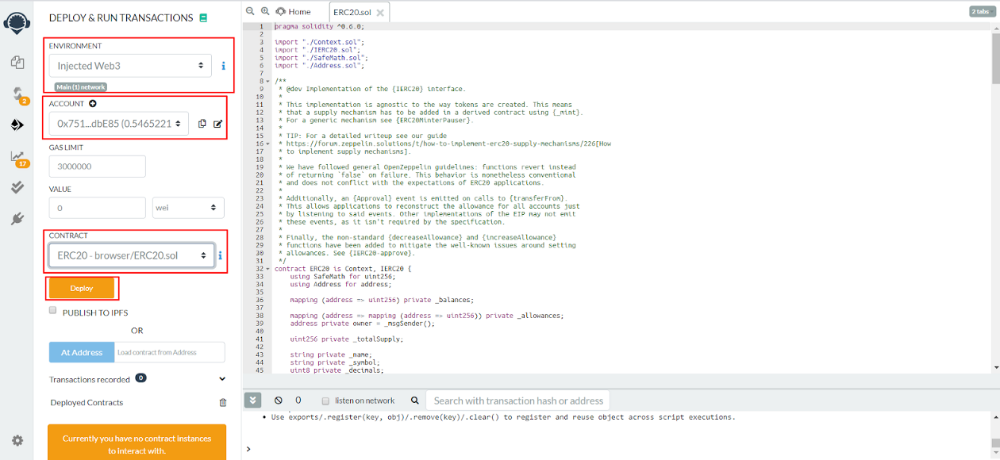
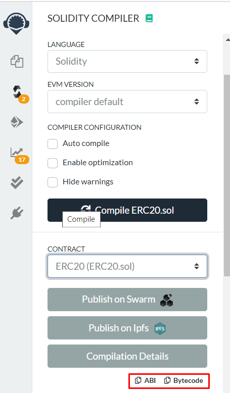

# Deploy a Smart Contract on Avalanche Using Remix and MetaMask

## Introduction

Avalanche's Primary Network is a subnet that has three chains: P-Chain, X-Chain, and C-Chain. The C-Chain is an instance of the Ethereum Virtual Machine powered by Avalanche’s Snowman consensus protocol. The [C-Chain RPC](../../avalanchego-apis/contract-chain-c-chain-api.md) can do anything a typical Ethereum client can by using the Ethereum-standard RPC calls. The immediate benefits of using the C-Chain rather than Ethereum are all of the benefits of using Avalanche. These properties that could considerably improve the performance of DApps and the user experience.

Today, we will deploy and test a smart contract on Avalanche using Remix and MetaMask.

## Step 1: Setting up MetaMask

Log in to MetaMask -&gt; Click the Network drop-down -&gt; Select Custom RPC

**FUJI Testnet Settings:**

* **Network Name**: Avalanche FUJI C-Chain
* **New RPC URL**: [https://api.avax-test.network/ext/bc/C/rpc](https://api.avax-test.network/ext/bc/C/rpc)
* **ChainID**: `0xa869`
* **Symbol**: `AVAX`
* **Explorer**: [https://cchain.explorer.avax-test.network](https://cchain.explorer.avax-test.network/)

#### **Avalanche Mainnet Settings:**

* **Network Name**: Avalanche Mainnet C-Chain
* **New RPC URL**: [https://api.avax.network/ext/bc/C/rpc](https://api.avax.network/ext/bc/C/rpc)
* **ChainID**: `0xa86a`
* **Symbol**: `AVAX`
* **Explorer**: [https://cchain.explorer.avax.network/](https://cchain.explorer.avax.network/)

#### **Local Testnet \(AVASH\) Settings:**

* **Network Name**: Avalanche Local
* **New RPC URL**:[http://localhost:9650/ext/bc/C/rpc](http://localhost:9650/ext/bc/C/rpc)
* **ChainID**: `0xa868`
* **Symbol**: `AVAX`
* **Explorer**: N/A

## Step 2: Funding your C-Chain address

### **Funding your C-Chain address on FUJI** 

Navigate to [https://faucet.avax-test.network/](https://faucet.avax-test.network/) and paste your C-AVAX address. All you need to do is add a “C-” prefix and the faucet will switch from AVAX to C-AVAX.

### Funding your C-Chain address on Mainnet 

Funding your C-chain address on mainnet is done through a cross-chain swap from X-chain to C-chain.



### Funding your C-chain address on local testnet 

Deploy your own faucet. [Tutorial](https://medium.com/avalabs/the-ava-platform-tools-pt-2-the-ava-faucet-48f28da57146)

## Step 3: Connect MetaMask and deploy a smart contract using Remix

Open [Remix](https://remix.ethereum.org/) -&gt; Select Solidity

Load or create the smart contracts that we want to compile and deploy using Remix file explorer.

For this example, we will deploy an ERC20 contract from [OpenZeppelin](https://openzeppelin.com/contracts).

Navigate to Deploy Tab -&gt; Open the “ENVIRONMENT” drop-down and select Injected Web3 \(make sure MetaMask is loaded\)

Once we injected the web3-&gt; Go back to the compiler, and compile the selected contract -&gt; Navigate to Deploy Tab

Now, the smart contract is compiled, MetaMask is injected, and we are ready to deploy our ERC20. Click “Deploy.”

Confirm the transaction on the MetaMask pop up.

Our contract is successfully deployed!

Now, we can expand it by selecting it from the “Deployed Contracts” tab and test it out.

The contract ABI and Bytecode are available on the compiler tab.

If you had any difficulties following this tutorial or simply want to discuss Avalanche with us, you can join our community at [Discord](https://chat.avalabs.org/)!

