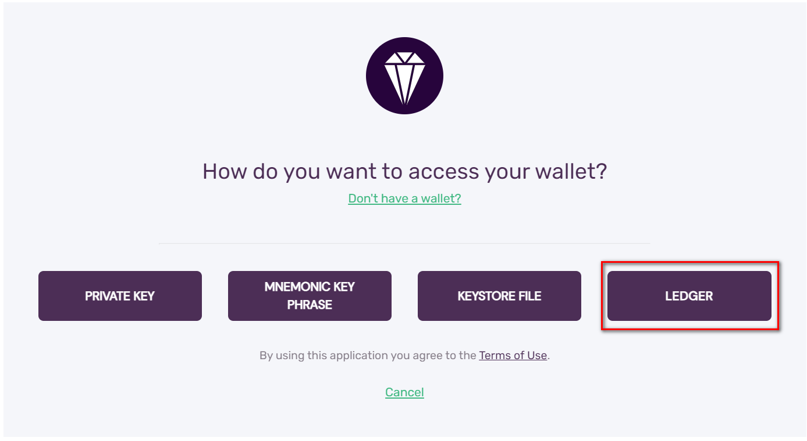
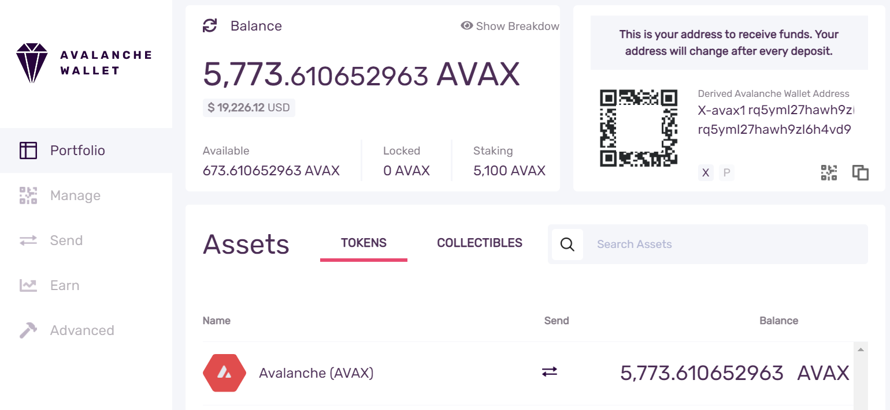
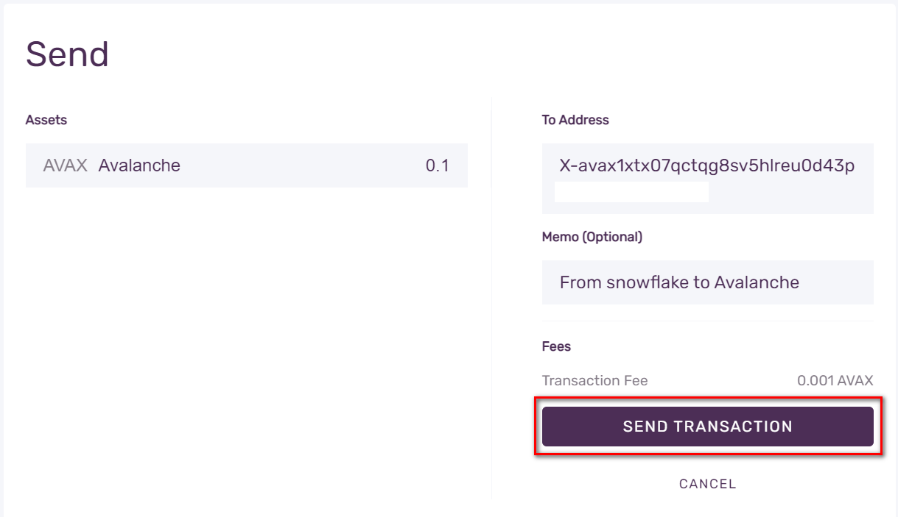
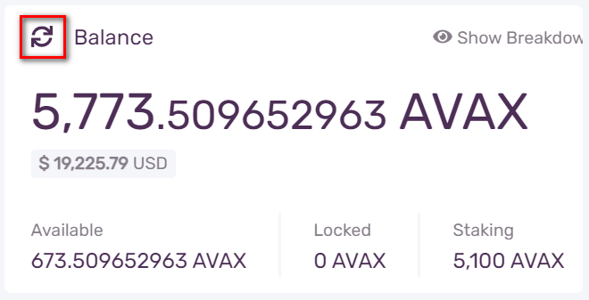
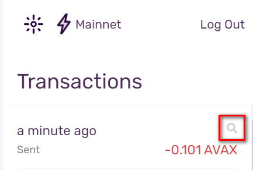
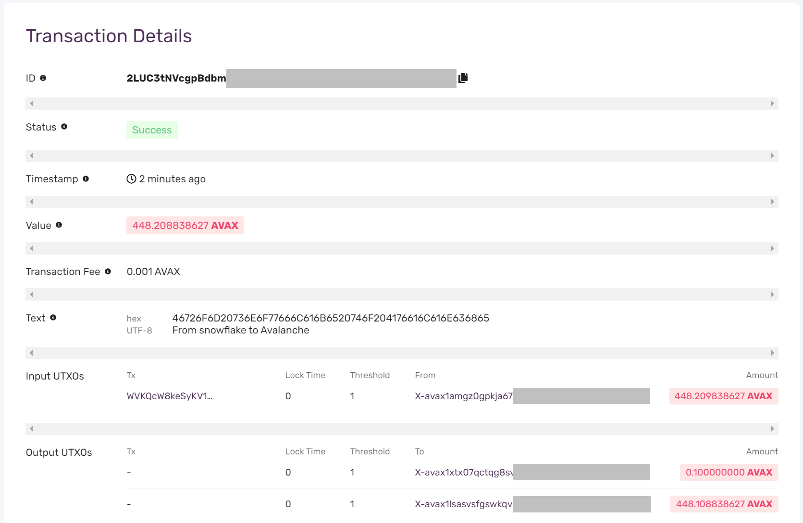

# Configura tu Ledger Nano S con Avalanche

El estándar de la industria para asegurar con seguridad las criptodivisas son las carteras de hardware, dispositivos especializados que proporcionan un aislamiento total entre su ordenador y sus claves privadas.

Si quieres usar la dirección de Avalanche que creaste antes, necesitas usar el procedimiento [restaurar desde la frase de recuperación](https://support.ledger.com/hc/en-us/articles/360005434914)  usando la frase mnemónica que obtuviste de la cartera de Avalanche. Si estás creando una nueva dirección, sólo sigue las instrucciones normales [establecer como nuevo dispositivo](https://support.ledger.com/hc/en-us/articles/360000613793-Set-up-as-new-device).

La aplicación de Ledger Wallet de Avalanche está disponible actualmente a través de [Ledger Live](https://www.ledger.com/ledger-live) en Modo Experimental.

## Cómo Configurar Avalanche en Ledger Live 

Primero necesitarás instalar [Ledger Live](https://www.ledger.com/ledger-live). 
Hay opciones de descarga para MacOS, Windows y Linux, así como para iOS y Android.

A continuación, enciende Ledger Live y haz clic en el botón **Settings**

Una vez en la configuración, vaya a la pestaña **Experimental features**.

Desplácese hacia abajo hasta el interruptor  del **Developer mode** y actívelo.

Ahora con el **Developer Mode** activado, puedes ir a la pestaña "Gerente" y buscar **Avalanche**. Confirma que la aplicación Avalanche es la v0.2.1, y haz clic en el botón **Install**.

Puedes confirmar que la instalación fue exitosa yendo a la pestaña **Apps installed** donde deberías ver Avalanche v0.2.1.

## Usar la Wallet de Avalanche con Ledger 

Una vez que tengas la aplicación de Avalanche instalada, podrás interactuar con la [Wallet de Avalanche](https://wallet.avax.network/) a través del Ledger. Esto incluye el envío de AVAX, fichas, NFTs, intercambios cross-chain entre la X-Chain&lt;-&gt;P-Chain así como hacer stake de tokens.

Primero, para acceder a la Wallet, conecte el Ledger a su ordenador y, si es necesario, introduzca su pin.

A continuación, si ves el texto **Pending Ledger review**, haz clic en los dos botones de la parte superior del dispositivo para saltar esa pantalla.

Por último, deberías aterrizar en la pantalla de la aplicación **Avalanche** donde puedes confirmar que la aplicación es la versión 0.2.1.

Después de confirmar que la aplicación Avalanche está funcionando, entonces en la página de inicio de la Wallet haga clic en el botón **Access Wallet**.

En el siguiente mensaje **How do you want to access your wallet?**, haga clic en el botón **Ledger**.

Ahora se le pedirá que confirme en su dispositivo Ledger. Haz clic con el botón derecho en las indicaciones del dispositivo y en la última pantalla confirma pulsando ambos botones.

Si tiene éxito, se ingresará en la wallet y se mostrarán los saldos anteriores.

Para transferir fondos, vaya a la pestaña **Send** y pegue una dirección de la X-Chain en el campo **To Address**. Establezca una cantidad y opcionalmente establezca una nota. Presione **Confirm** y luego el botón **Send Transaction**.

Se le pedirá que confirme la acción en su Ledger. Comprueba que el hash que aparece en la cartera de la web coincide con el que aparece en tu Ledger. Si todo coincide, confirma pulsando los dos botones de la última pantalla para enviar la transacción.

Puede hacer clic en el icono para actualizar su saldo y debería verlo disminuir por el importe que acaba de enviar y la tarifa de la transacción.

En la columna de la derecha, verá su última transacción. Al hacer clic en el icono de la lupa se abrirá la transacción en nuestro explorador.

Finalmente, debería poder ver los detalles de la transacción en nuestro explorador. Aquí se enumera todo lo relativo a la transacción, incluyendo el ID de la transacción, el estado, cuándo se produjo la transacción y toda la información relativa a las entradas y salidas.

## Más herramientas por venir 

Ava Labs is building the Internet of Finance. We’re developing solutions to create a frictionless world by redefining the way people build and use finance applications. A critical part of this infrastructure is a hardware wallet so users can be totally confident that their private keys and coins are completely isolated from any potentially malicious actors. Our newly released Ledger app does just this by following industry best practices to keep users and coins safe and secure.

<!--stackedit_data:
eyJoaXN0b3J5IjpbMTQyMjMyMTcxNV19
-->