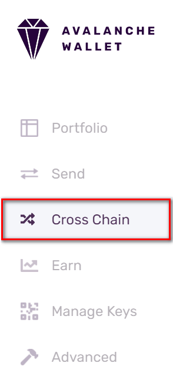
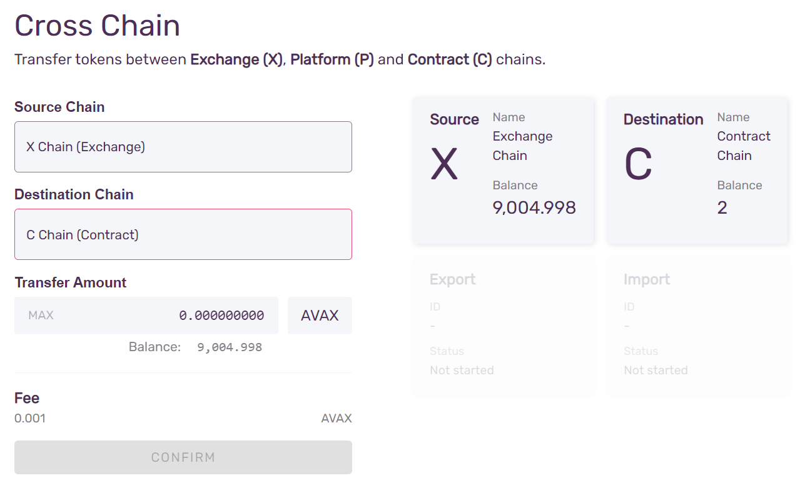
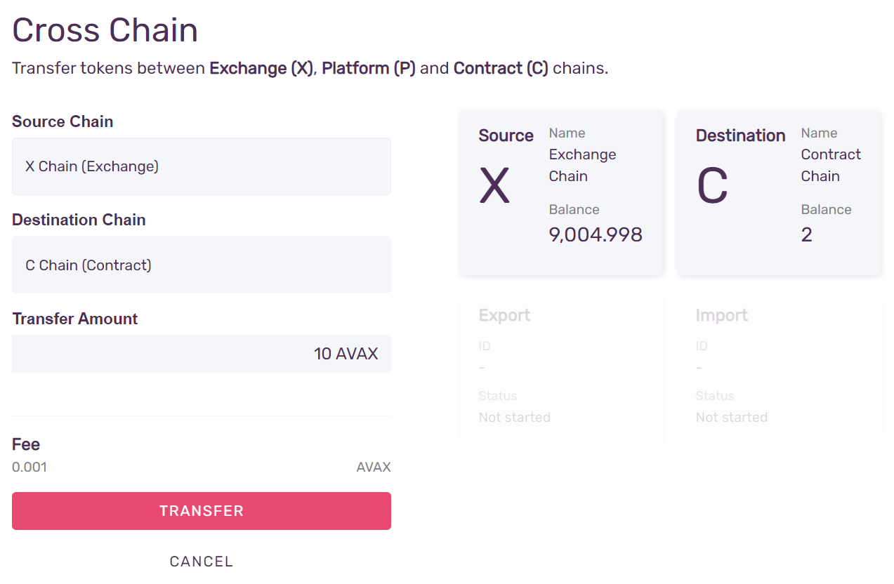
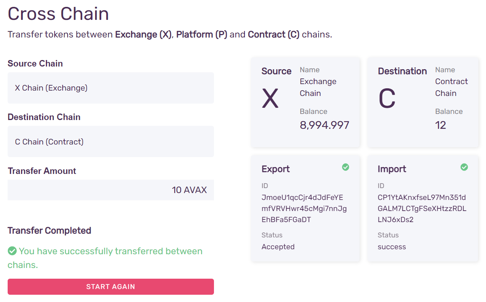

# Transferir AVAX entre la X-Chain y la C-Chain

## Introducción

Los Tokens de AVAX existen en la X-Chain, donde se pueden tradear, en la P-Chain, donde se pueden proporcionar como stake al validar la Red Primaria, y en la C-Chain, donde se pueden utilizar en smart contracts o para pagar el gas. En este tutorial, enviaremos tokens de AVAX entre la X-Chain y la C-Chain.

## Requisitos

Haber completado [Ejecutar un Nodo de Avalanche](../../getting-started.md) y que seas familiar con [La Arquitectura de Avalanche](../../../learn/platform-overview/).

¡Para poder enviar AVAX, necesitas tener algo de AVAX! Puedes conseguir AVAX de verdad comprándola en un exchange, o puedes conseguir AVAX de la red de pruebas desde el [Faucet de Prueba de AVAX](https://faucet.avax-test.network), que es una forma gratis y fácil de ir jugando con Avalanche.

## Transferir AVAX usando la Wallet Web

La forma más fácil de transferir AVAX entre cadenas es usar [La Wallet de Avalanche](https://wallet.avax.network/) que es una forma segura y no custodiada de acceder y mover AVAX.

El código fuente de la Wallet de Avalanche se puede encontrar [aquí](https://github.com/ava-labs/avalanche-wallet).

### Paso 1 - Abre la Wallet de Avalanche


Selecciona **Access Wallet** para ingresar a tu Wallet. Para conectar la Wallet una red que no sea la red principal de Avalanche, selecciona **Mainnet** y elige la red a la que se conectará.


### Paso 2 - Iniciar Sesión en tu Wallet

Puedes acceder a tu wallet utilizando el private key, la frase mnemónica, el archivo keystore o Ledger Nano S. Las transferencias de C-Chain a través de Ledger no están soportadas todavía.


Después de un inicio de sesión exitoso, verás tu saldo, tu portafolio de activos y otra información diversa.

### Paso 3 - Ve a la pestaña de Cross Chain



La función para transferir Tokens entre cadenas está en la pestaña **Cross Chain**.

### Paso 4 - Introduce la Cantidad a Transferir

Se te presentará una opción para **Source Chain** y **Destination Chain**.  Selecciona X-Chain y C-Chain, respectivamente. Verás tus saldos X y C, y un campo de entrada para ingresar el monto a transferir de la cadena de origen a la de destino.



Introduce la cantidad que deseas transferir desde la X-Chain a la C-Chain.

### Paso 5 - Confirma la Transacción



Presiona **Confirm**, y luego **Transfer** para iniciar la transferencia.

### Paso 6 - Listo!

La transferencia entre cadenas es un proceso de dos pasos: primero una transacción para exportar los fondos de la X-Chain y otra para importarlos a la C-Chain. La Wallet hará ambas cosas y mostrará su progreso mientras lo hace.



¡Eso es! ¡Has transferido AVAX de la X-Chain a la C-Chain Ahora puedes usarlas para desplegar smart contracts en la C-Chain.

### Transferir desde C-Chain a la X-chain

Para devolver AVAX de vuelta a la X-Chain, tienes que hacer la transferencia en la dirección opuesta.

Intercambie la cadena de origen y destino, seleccionándolos en el menú desplegable **Source** y **Destination**. El resto del proceso es el mismo: introducir el importe, confirmar y transferir.

## Transferencia de la  X-Chain a la C-Chain  con llamados API

Si estás construyendo una aplicación en la red de Avalanche, tal vez quieras hacer la transferencia programada como parte de una funcionalidad más amplia. Puedes hacerlo llamando a las API adecuadas en un nodo de AvalancheGo. El resto del tutorial asume que tienes acceso a un nodo de AvalancheGo, tokens de AVAX en la X-Chain y credenciales de usuario [creadas](../../avalanchego-apis/keystore-api.md#keystorecreateuser) y almacenadas en el keystore del nodo.

Todos los llamados API de ejemplo a continuación asumen que el nodo se está ejecutando localmente \(es decir, escuchando en `127.0.0.1`\). 
El nodo puede conectarse a la red principal, a una red de prueba o a una red local. En cada caso, los llamados y respuestas de la API deben ser las mismas, excepto en lo que respecta a los formatos de dirección. No es necesario que el nodo sea local; se pueden hacer llamados a un nodo alojado en otro lugar.

Como puede haber notado al transferir AVAX usando la Wallet de Avalanche, una transferencia cross-chain es una operación de dos transacciones:

* Exportar AVAX desde la X-Chain
* Importar AVAX a la C-Chain

Antes de que podamos hacer la transferencia, tenemos que establecer la dirección en la C-Chain, junto con la control key.

### Configurar la Dirección y la Clave en la C-Chain

La X-Chain usa direcciones [Bech32](http://support.avalabs.org/en/articles/4587392-what-is-bech32) y la C-Chain utiliza direcciones hexadecimales de Ethereum Virtual Machines \(EVM\). No hay forma de convertir la dirección de un formato a otro, ya que ambos se derivan de una private key usando una función criptográfica unidireccional.

I
Para evitar esto, puedes exportar una private key de la X-Chain y luego importarla a la C-Chain. De esta manera, puedes usar la dirección de la X-Chain y cambiar el prefijo X- por un prefijo C- para obtener la dirección Bech32 correcta para la C-Chain

Primero, exporta una clave privada de la X-Chain:

```cpp
curl -X POST --data '{
    "jsonrpc":"2.0",
    "id"     :1,
    "method" :"avm.exportKey",
    "params" :{
        "username" :"myUsername",
        "password":"myPassword",
        "address": "X-avax1jggdngzc9l87rgurmfu0z0n0v4mxlqta0h3k6e"
    }
}' -H 'content-type:application/json;' 127.0.0.1:9650/ext/bc/X
```

Respuesta:

```cpp
{
    "jsonrpc":"2.0",
    "id"     :1,
    "result" :{
        "privateKey":"PrivateKey-2w4XiXxPfQK4TypYqnohRL8DRNTz9cGiGmwQ1zmgEqD9c9KWLq"
    }
}
```

Ahora, importa la misma private key en la C-Chain:

```cpp
curl -X POST --data '{  
    "jsonrpc":"2.0",    
    "id"     :1,    
    "method" :"avax.importKey", 
    "params" :{ 
        "username" :"myUsername",   
        "password":"myPassword",    
        "privateKey":"PrivateKey-2w4XiXxPfQK4TypYqnohRL8DRNTz9cGiGmwQ1zmgEqD9c9KWLq"    
    }   
}' -H 'content-type:application/json;' 127.0.0.1:9650/ext/bc/C/avax
```

La respuesta contiene una dirección EVM codificada en hexadecimal:

```cpp
{
    "jsonrpc": "2.0",
    "result": {
        "address": "0x5Bf544EF123FE41B262295dBA41c5a9CFA8efDB4"
    },
    "id": 1
}
```

Ahora tenemos todo lo que necesitamos para transferir los tokens.

### Transferir desde la X-Chain a la C-Chain

Utilice la dirección correspondiente a la private key que ha exportado y cambie a utilizar el prefijo C- en  [`avm.exportAVAX`](../../avalanchego-apis/exchange-chain-x-chain-api.md#avm-exportavax): al momento de ejecutar

```cpp
curl -X POST --data '{  
    "jsonrpc":"2.0",    
    "id"     :1,    
    "method" :"avm.exportAVAX", 
    "params" :{ 
        "to":"C-avax1jggdngzc9l87rgurmfu0z0n0v4mxlqta0h3k6e",   
        "destinationChain": "C",    
        "amount": 5000000,  
        "username":"myUsername",    
        "password":"myPassword" 
    }   
}' -H 'content-type:application/json;' 127.0.0.1:9650/ext/bc/X
```

Dado que el usuario de tu keystore posee la correspondiente private key en la C-Chain, ahora puedes importar los AVAX a la dirección que elijas. No es necesario importarla a la misma dirección a la que fue exportada, por lo que puede importar la AVAX a una dirección que posea en MetaMask u otro servicio de terceros.

```cpp
curl -X POST --data '{
    "jsonrpc":"2.0",
    "id"     :1,    
    "method" :"avax.importAVAX",    
    "params" :{ 
        "to":"0x4b879aff6b3d24352Ac1985c1F45BA4c3493A398",  
        "sourceChain":"X",  
        "username":"myUsername",    
        "password":"myPassword" 
    }   
}' -H 'content-type:application/json;' 127.0.0.1:9650/ext/bc/C/avax
```

donde `to` es una dirección EVM con código hexadecimal de su elección.

La respuesta se ve así:

```cpp
{   
    "jsonrpc": "2.0",   
    "result": { 
        "txID": "LWTRsiKnEUJC58y8ezAk6hhzmSMUCtemLvm3LZFw8fxDQpns3" 
    },  
    "id": 1 
}
```


Nota: no se cobra ninguna tarifa por las transacciones de importación a la C-Chain.

Una vez que tus AVAX ha sido transferida a la C-Chain, puede usarla para desplegar e interactuar con contratos inteligentes.

## Transferir desde la C-Chain a la X-Chain

Ahora, puedes mover AVAX desde la C-Chain to the X-Chain. Primero necesitamos exportar:

```cpp
curl -X POST --data '{  
    "jsonrpc":"2.0",    
    "id"     :1,    
    "method" :"avax.exportAVAX",
    "params" :{ 
        "to":"X-avax1wkmfja9ve3lt3n9ye4qp3l3gj9k2mz7ep45j7q",   
        "amount": 5000000,  
        "username":"myUsername",    
        "password":"myPassword" 
    }   
}' -H 'content-type:application/json;' 127.0.0.1:9650/ext/bc/C/avax
```

donde `to` es la dirección codificada en bech32 de una dirección X-Chain que tienes. Asegúrate de que la cantidad que exportas excede la comisión de transacción porque tanto las transacciones de exportación como las de importación cobrarán una comisión de transacción.

La respuesta debería verse así:

```cpp
{   
    "jsonrpc": "2.0",   
    "result": { 
        "txID": "2ZDt3BNwzA8vm4CMP42pWD242VZy7TSWYUXEuBifkDh4BxbCvj"    
    },  
    "id": 1 
}
```

Para terminar la transferencia, ejecuta [`avm.importAVAX`](../../avalanchego-apis/exchange-chain-x-chain-api.md#avm-importavax).

```cpp
curl -X POST --data '{  
    "jsonrpc":"2.0",    
    "id"     :1,    
    "method": "avm.importAVAX", 
    "params": { 
        "username":"myUsername",    
        "password":"myPassword",    
        "sourceChain": "C", 
        "to":"X-avax1wkmfja9ve3lt3n9ye4qp3l3gj9k2mz7ep45j7q"    
    }   
}' -H 'content-type:application/json;' 127.0.0.1:9650/ext/bc/X
```

donde `to` es la dirección codificada de bech32 la dirección de la X-Chain a la que enviaste los fondos en el paso anterior.

La respuesta debería verse así:

```cpp
{   
    "jsonrpc": "2.0",   
    "result": { 
        "txID": "2kxwWpHvZPhMsJcSTmM7a3Da7sExB8pPyF7t4cr2NSwnYqNHni"    
    },  
    "id": 1 
}
```

## Concluimos!

¡Eso es! Ahora, puedes intercambiar AVAX entre la X-Chain y la C-Chain, usando la Wallet de Avalanche, y haciendo llamados a la API apropiada en un nodo de Avalanche.

<!--stackedit_data:
eyJoaXN0b3J5IjpbLTE1MjY4ODEzNTQsMTEyODI1MTA5M119
-->