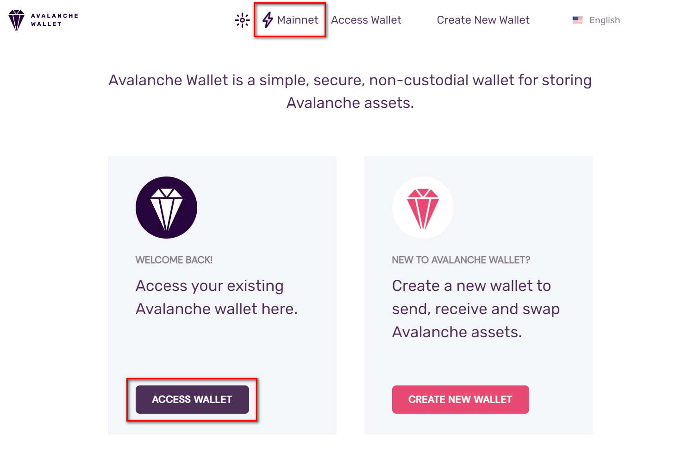
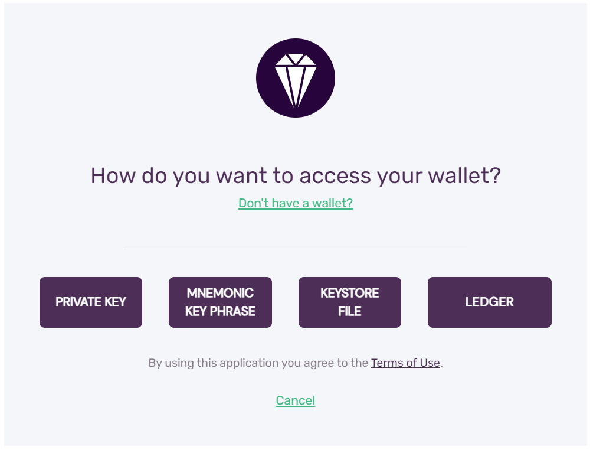
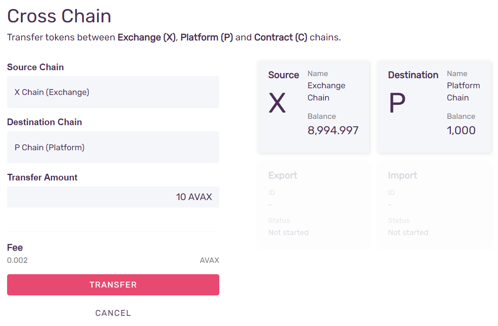
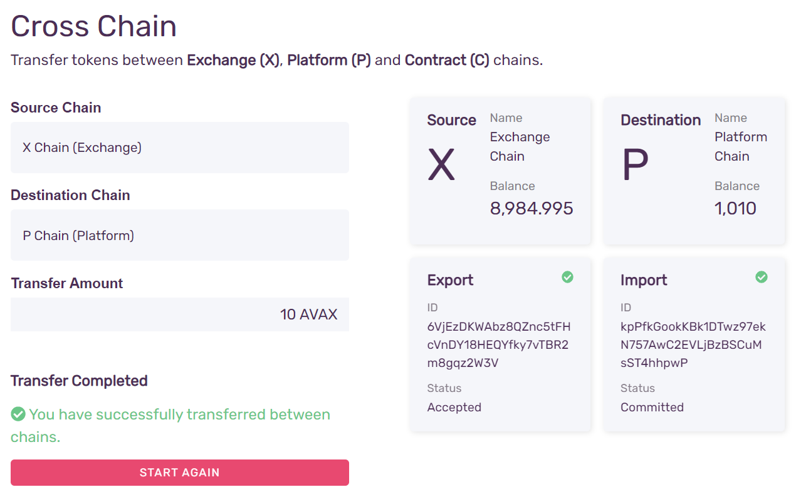

# Transferir AVAX entre la X-Chain y la P-Chain

## Introduction

Los Tokens de AVAX existen en la X-Chain, donde se pueden tradear, en la P-Chain, donde se pueden proporcionar como stake al validar la Red Primaria, y en la C-Chain, donde se pueden utilizar en smart contracts o para pagar el gas. Avalanche apoya el movimiento de AVAX entre estas cadenas, y en el futuro, Avalanche apoyará más intercambios atómicos genéricos entre cadenas. En este tutorial, enviaremos fichas AVAX entre la X-Chain y la P-Chain.

## Requisitos

Haber completado [Ejecutar un Nodo de Avalanche](../../getting-started.md) y que seas familiar con [La Arquitectura de Avalanche](../../../learn/platform-overview/).


¡Para poder enviar AVAX, necesitas tener algo de AVAX! Puedes conseguir AVAX de verdad comprándola en un exchange, o puedes conseguir AVAX de la red de pruebas desde el [Faucet de Prueba de AVAX](https://faucet.avax-test.network), que es una forma gratis y fácil de ir jugando con Avalanche.

## Transferir AVAX usando la Wallet Web

La forma más fácil de transferir AVAX entre cadenas es usar [La Wallet de Avalanche](https://wallet.avax.network/) que es una forma segura y no custodiada de acceder y mover AVAX.

El código fuente de la Wallet de Avalanche se puede encontrar [aquí](https://github.com/ava-labs/avalanche-wallet).


### Paso 1 - Abre la Wallet de Avalanche



Selecciona **Access Wallet** para ingresar a tu Wallet. Para conectar la Wallet una red que no sea la red principal de Avalanche, selecciona **Mainnet** y elige la red a la que se conectará.

### Paso 2 - Iniciar Sesión en tu Wallet

Puedes acceder a tu wallet utilizando el private key, la frase mnemónica, el archivo keystore o Ledger Nano S



Después de un inicio de sesión exitoso, verás tu saldo, tu portafolio de activos y otra información diversa.

### Paso 3 - Ve a la pestaña de Cross Chain


La función para transferir Tokens entre cadenas está en la pestaña **Cross Chain**.

### Paso 4 - Introduce la Cantidad a Transferir

Se te presentará una opción para **Source Chain** y **Destination Chain**.  Selecciona X-Chain y  P-Chain, espectivamente. Verás tus saldos X y P, y un campo de entrada para ingresar el monto a transferir de la cadena de origen a la de destino.


Introduce la cantidad que deseas transferir desde la X-Chain a la P-Chain.

### Paso 5 - Confirma la Transacción



Presiona **Confirm**, y luego **Transfer** para iniciar la transferencia.

### Paso 6 - Listo!

La transferencia entre cadenas es un proceso de dos pasos: primero una transacción para exportar los fondos de la X-Chain y otra para importarlos a la P-Chain. La Wallet hará ambas cosas y mostrará su progreso mientras lo hace.



¡Eso es todo! ¡Has transferido AVAX de la X-Chain a la P-Chain! Ahora puede usarlos para validar o delegar en la red de Avalanche.

### Transferir desde P-Chain a la X-Chain

Para devolver AVAX de vuelta a la X-Chain, tienes que hacer la transferencia en la dirección opuesta.

Intercambie la cadena de origen y destino, seleccionándolos en el menú desplegable **Source** y **Destination**. El resto del proceso es el mismo: introducir el importe, confirmar y transferir.

## Transferencia de la  X-Chain a la P-Chain  con llamados API

Si estás construyendo una aplicación en la red de Avalanche, tal vez quieras hacer la transferencia programada como parte de una funcionalidad más amplia. Puedes hacerlo llamando a las API adecuadas en un nodo de AvalancheGo. El resto del tutorial asume que tienes acceso a un nodo de AvalancheGo, tokens de AVAX en la X-Chain, y credenciales de usuario [creadas](../../avalanchego-apis/keystore-api.md#keystorecreateuser) y almacenadas en el keystore del nodo.


Todos los llamados API de ejemplo a continuación asumen que el nodo se está ejecutando localmente \(es decir, escuchando en `127.0.0.1`\). 
El nodo puede conectarse a la red principal, a una red de prueba o a una red local. En cada caso, los llamados y respuestas de la API deben ser las mismas, excepto en lo que respecta a los formatos de dirección. No es necesario que el nodo sea local; se pueden hacer llamados a un nodo alojado en otro lugar.

Como puedes haber notado al transferir AVAX usando la Wallet de Avalanche, una transferencia cross-chain es una operación de dos transacciones:

* Exportar AVAX desde la X-Chain
* Importar AVAX a la P-chain

### Paso 1 - Exportar AVAX desde la X-Chain


Para exportar AVAX, ejecuta el método de la X-Chain [`avm.exportAVAX`](../../avalanchego-apis/exchange-chain-x-chain-api.md#avm-exportavax).

Tu solicitud debería verse así:

```cpp
curl -X POST --data '{
    "jsonrpc":"2.0",
    "id"     :1,
    "method" :"avm.exportAVAX",
    "params" :{
        "to":"P-avax1wkmfja9ve3lt3n9ye4qp3l3gj9k2mz7ep45j7q",
        "destinationChain": "P",
        "amount": 5000000,
        "changeAddr": "X-avax1turszjwn05lflpewurw96rfrd3h6x8flgs5uf8",
        "username":"myUsername",
        "password":"myPassword"
    }
}' -H 'content-type:application/json;' 127.0.0.1:9650/ext/bc/X
```

donde `to` es la dirección de una cadena P-Chain que el usuario controla y `changeAddr`es la dirección a la que enviar cualquier cambio. Puedes dejar `changeAddr en blanco; si lo dejas en blanco, el cambio será devuelto a una dirección controlada por tu usuario \(Ve [aquí](../../avalanchego-apis/platform-chain-p-chain-api.md#platform-createaddress) para instrucciones sobre cómo crear una nueva dirección de la P-Chain\).

Ten en cuenta que pagarás una comisión por las operaciones de exportación e importación. En este ejemplo, asumamos que la comisión por la transacción es de "0,001" AVAX. Entonces, la exportación anterior consume realmente `.006` AVAX; `.005` va a la P-Chain y `.001` se quema como comisión por la transacción.

Asegúrate de que la cantidad que envías excede la comisión por la transacción. De lo contrario, cuando importes AVAX a la P-Chain, consumirá la comisión de la transacción, y acabarás con _menos_ AVAX en la P-Chain.

La respuesta debería verse así:

```cpp
{
    "jsonrpc": "2.0",
    "result": {
        "txID": "MqEaeWc4rfkw9fhRMuMTN7KUTNpFmh9Fd7KSre1ZqTsTQG73h",
        "changeAddr": "X-avax1turszjwn05lflpewurw96rfrd3h6x8flgs5uf8",
    },
    "id": 1
}
```

Podemos verificar que esta transacción fue aceptada ejecutando: [`avm.getTxStatus`](../../avalanchego-apis/exchange-chain-x-chain-api.md#avm-gettxstatus):

```cpp
curl -X POST --data '{
    "jsonrpc": "2.0",
    "method": "avm.getTxStatus",
    "params":{
        "txID":"MqEaeWc4rfkw9fhRMuMTN7KUTNpFmh9Fd7KSre1ZqTsTQG73h"
    },
    "id": 1
}' -H 'content-type:application/json;' 127.0.0.1:9650/ext/bc/X
```

La cual nos muestra que nuestra transacción fué aceptada:

```cpp
{
    "jsonrpc": "2.0",
    "result": {
        "status": "Accepted"
    },
    "id": 1
}
```

También podemos ejecutar [`avm.getBalance`](../../avalanchego-apis/exchange-chain-x-chain-api.md#avm-getbalance) para comprobar que el AVAX fue deducido de una dirección de nuestro usuario:

```cpp
curl -X POST --data '{
    "jsonrpc":"2.0",
    "id"     :1,
    "method" :"avm.getBalance",
    "params" :{
        "address":"X-ADDRESSGOESHERE",
        "assetID":"AVAX"
    }
}' -H 'content-type:application/json;' 127.0.0.1:9650/ext/bc/X
```

El monto deducido es el monto exportado \(`.005` AVAX en este ejemplo\) además de la comisión de la transacción. Si tu usuario controla múltiples direcciones de la X-Chain, el AVAX puede haber sido enviado desde cualquier combinación de ellas.

### Paso 2 - Importar AVAX a la P-Chain

Nuestra transferencia no ha terminado todavía. Necesitamos ejecutar el método de la P-Chain[`platform.importAVAX`](../../avalanchego-apis/platform-chain-p-chain-api.md#platform-importavax) para terminar la transferencia.

Tu solicitud debería verse así:

```cpp
curl -X POST --data '{
    "jsonrpc": "2.0",
    "method": "platform.importAVAX",
    "params": {
        "to":"P-avax1wkmfja9ve3lt3n9ye4qp3l3gj9k2mz7ep45j7q",
        "sourceChain":"X",
        "changeAddr":"P-avax103y30cxeulkjfe3kwfnpt432ylmnxux8r73r8u",
        "username":"myUsername",
        "password":"myPassword",
    },
    "id": 1
}' -H 'content-type:application/json;' 127.0.0.1:9650/ext/bc/P
```

Esto nos proporciona el ID de la transacción:

```cpp
{
    "jsonrpc": "2.0",
    "result": {
        "txID": "2sxo3ySETZ4xzXqAtgsUvZ5pdkqG4SML4c7Z7NoKLZcp77YNXC",
        "changeAddr":"P-avax103y30cxeulkjfe3kwfnpt432ylmnxux8r73r8u"
    },
    "id": 1
}
```

Podemos comprobar que la transacción fué aceptada con:

```cpp
curl -X POST --data '{
    "jsonrpc":"2.0",
    "id"     :1,
    "method" :"avm.getTxStatus",
    "params" :{
        "txID":"2sxo3ySETZ4xzXqAtgsUvZ5pdkqG4SML4c7Z7NoKLZcp77YNXC"
    }
}' -H 'content-type:application/json;' 127.0.0.1:9650/ext/bc/X
```

Debería ser `Committed`, lo que significa que la transferencia está completa. También podemos comprobar el saldo de la dirección con:

```cpp
curl -X POST --data '{
    "jsonrpc": "2.0",
    "method": "platform.getBalance",
    "params":{
        "address":"P-avax1wkmfja9ve3lt3n9ye4qp3l3gj9k2mz7ep45j7q"
    },
    "id": 1
}' -H 'content-type:application/json;' 127.0.0.1:9650/ext/bc/P
```

La respuesta debería verse así:

```cpp
{
    "jsonrpc": "2.0",
    "result": {
        "balance": "4000000",
        "utxoIDs": [
            {
                "txID": "2sxo3ySETZ4xzXqAtgsUvZ5pdkqG4SML4c7Z7NoKLZcp77YNXC",
                "outputIndex": 0
            }
        ]
    },
    "id": 1
}
```

Observa que el saldo que vemos es la cantidad exportada de la X-Chain (`.004` AVAX\) menos la comisión por la transacción (`.001` AVAX en este ejemplo). Ahora, podemos usar los AVAX de esta dirección de la P-Chain para proporcionar stake para validar la Red Primaria.

## Transfiriendo de la P-Chain a la X-Chain de Forma Programada

Ahora, movamos el AVAX de la P-Chain a la X-Chain.

Al igual que antes, esta también es una operación de dos transacciones:

* Exportar desde la P-Chain
* Importar a la X-Chain

### Paso 1 - Exportar AVAX desde la P-Cha

To do so, call [`platform.exportAVAX`](../../avalanchego-apis/platform-chain-p-chain-api.md#platform-exportavax):

```cpp
curl -X POST --data '{
    "jsonrpc": "2.0",
    "method": "platform.exportAVAX",
    "params": {
        "to":"X-avax1fjn5rffqvny7uk3tjegjs6snwjs3hhgcpcxfax",
        "amount":3000000,
        "changeAddr":"P-avax103y30cxeulkjfe3kwfnpt432ylmnxux8r73r8u",
        "username":"myUsername",
        "password":"myPassword"
    },
    "id": 1
}' -H 'content-type:application/json;' 127.0.0.1:9650/ext/P
```

donde `to` es la dirección de la X-Chain a la que se está enviando los AVAX.

Esto nos proporciona el ID de la transacción, y podemos comprobar que la transacción fue realizada ejecutando [`platform.getTxStatus`](../../avalanchego-apis/platform-chain-p-chain-api.md#platform-gettxstatus). de nuevo, Asegúrate de que la cantidad que envías excede la comisión por la transacción.

### Paso 2 - Importar AVAX a X-Chain

Para finalizar nuestra transferencia de P-Chain a la X-Chain, ejecuta[`avm.importAVAX`](../../avalanchego-apis/exchange-chain-x-chain-api.md#avm-importavax):

```cpp
curl -X POST --data '{
    "jsonrpc":"2.0",
    "id"     :1,
    "method" :"avm.importAVAX",
    "params" :{
        "to":"X-avax1fjn5rffqvny7uk3tjegjs6snwjs3hhgcpcxfax",
        "sourceChain":"P",
        "changeAddr": "X-avax1turszjwn05lflpewurw96rfrd3h6x8flgs5uf8",
        "username":"myUsername",
        "password":"myPassword"
    }
}' -H 'content-type:application/json;' 127.0.0.1:9650/ext/bc/X
```

Observe que `to` es la misma dirección que especificamos  cuando ejecutamos [`platform.exportAVAX`](../../avalanchego-apis/platform-chain-p-chain-api.md#platform-exportavax).

Al igual que antes, podemos [`avm.getBalance`](../../avalanchego-apis/exchange-chain-x-chain-api.md#avm-getbalance) to verify the funds were received. The balance should have increased by `.003` AVAX minus the transaction fee.

## Wrapping Up

That’s it! Now, you can swap AVAX back and forth between the X-Chain and P-Chain, both by using the Avalanche Wallet, and by calling the appropriate API calls on an Avalanche node.

Now you can use the tokens on the P-Chain to [add a node as a validator](../nodes-and-staking/add-a-validator.md) on the Primary Network.

<!--stackedit_data:
eyJoaXN0b3J5IjpbMTg4NjY3ODkwM119
-->