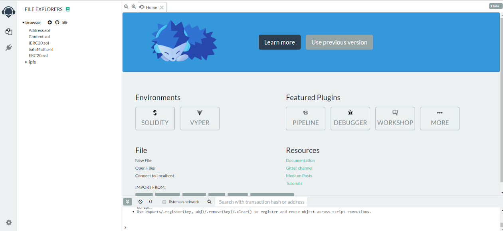
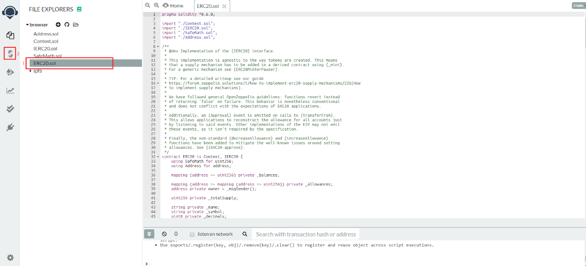
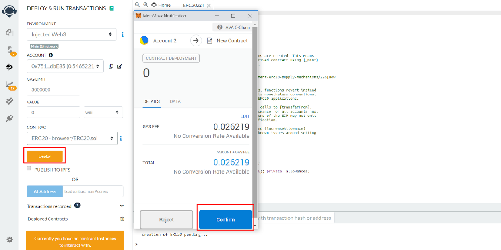
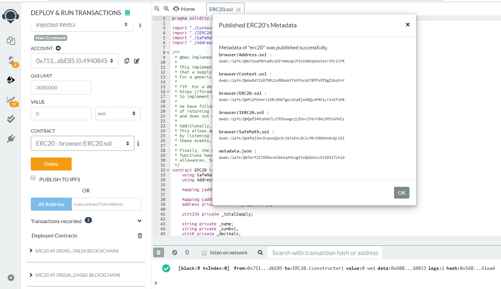

# Desplegar un Smart Contract en Avalanche usando Remix y MetaMask

## Introducción

La Red Primaria de Avalanche es una Subnet que tiene tres cadenas: P-Chain, X-Chain, y C-Chain. La C-Chain es una instancia de la Ethereum Virtual Machine impulsada por el protocolo de consenso Snowman de Avalanche. El [RPC de la C-Chain](../../avalanchego-apis/contract-chain-c-chain-api.md) puede hacer todo lo que un cliente típico de Ethereum puede hacer usando los llamados RPC estándar de Ethereum. Los beneficios inmediatos de usar la C-Chain en vez de Ethereum son todos los beneficios de usar Avalanche. Estas propiedades que podrían mejorar considerablemente el rendimiento de los DApps y la experiencia del usuario.

Hoy, desplegaremos y probaremos un smart contract en Avalanche usando Remix y MetaMask.

## Paso 1: Configurando MetaMask

Iniciamos sesión en MetaMask -&gt; Hacemos click en el menú desplegable Network -&gt; Selecciona Custom RPC

#### **Avalanche Mainnet Settings:**

* **Network Name**: Avalanche Mainnet C-Chain
* **New RPC URL**: [https://api.avax.network/ext/bc/C/rpc](https://api.avax.network/ext/bc/C/rpc)
* **ChainID**: `0xa86a`
* **Symbol**: `AVAX`
* **Explorer**: [https://cchain.explorer.avax.network/](https://cchain.explorer.avax.network/)

#### **FUJI Testnet Settings:**

* **Network Name**: Avalanche FUJI C-Chain
* **New RPC URL**: [https://api.avax-test.network/ext/bc/C/rpc](https://api.avax-test.network/ext/bc/C/rpc)
* **ChainID**: `0xa869`
* **Symbol**: `AVAX`
* **Explorer**: [https://cchain.explorer.avax-test.network](https://cchain.explorer.avax-test.network/)

#### **Local Testnet \(AVASH\) Settings:**

* **Network Name**: Avalanche Local
* **New RPC URL**:[http://localhost:9650/ext/bc/C/rpc](http://localhost:9650/ext/bc/C/rpc)
* **ChainID**: `0xa868`
* **Symbol**: `AVAX`
* **Explorer**: N/A

## Step 2: Funding your C-Chain address

### **Using Avalanche Wallet**

On the main net, you can use the [Avalanche Wallet](https://wallet.avax.network/) to transfer funds from the X-Chain to your C-Chain address. The process is simple, as explained in this [tutorial](../platform/transfer-avax-between-x-chain-and-c-chain.md). Wallet can be used on test and local networks, too.

### **Using Test Network Faucet**

For funding on the test network, you can also use the Test Network Faucet. Navigate to [https://faucet.avax-test.network/](https://faucet.avax-test.network/) and paste your C-AVAX address. All you need to do is add a “C-” prefix and the faucet will switch from AVAX to C-AVAX.

### Funding on local testnet

On a local network, you can easily fund your addresses by deploying your own faucet. [Tutorial](https://medium.com/avalabs/the-ava-platform-tools-pt-2-the-ava-faucet-48f28da57146)

## Step 3: Connect MetaMask and deploy a smart contract using Remix

Open [Remix](https://remix.ethereum.org/) -&gt; Select Solidity

Load or create the smart contracts that we want to compile and deploy using Remix file explorer.

For this example, we will deploy an ERC20 contract from [OpenZeppelin](https://openzeppelin.com/contracts).

Navigate to Deploy Tab -&gt; Open the “ENVIRONMENT” drop-down and select Injected Web3 \(make sure MetaMask is loaded\)

Once we injected the web3-&gt; Go back to the compiler, and compile the selected contract -&gt; Navigate to Deploy Tab

Now, the smart contract is compiled, MetaMask is injected, and we are ready to deploy our ERC20. Click “Deploy.”

Confirm the transaction on the MetaMask pop up.

Our contract is successfully deployed!

Now, we can expand it by selecting it from the “Deployed Contracts” tab and test it out.

The contract ABI and Bytecode are available on the compiler tab.

If you had any difficulties following this tutorial or simply want to discuss Avalanche with us, you can join our community at [Discord](https://chat.avalabs.org/)!

<!--stackedit_data:
eyJoaXN0b3J5IjpbNDQ4MDU1OTI1XX0=
-->