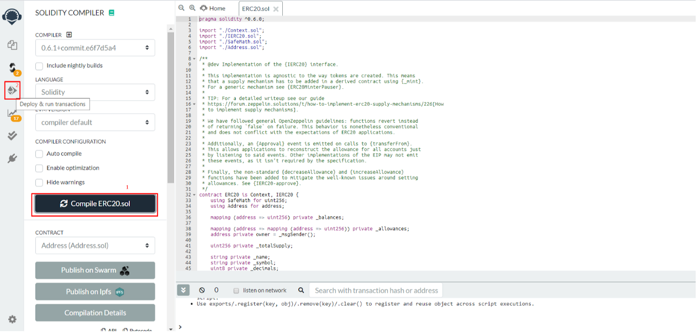
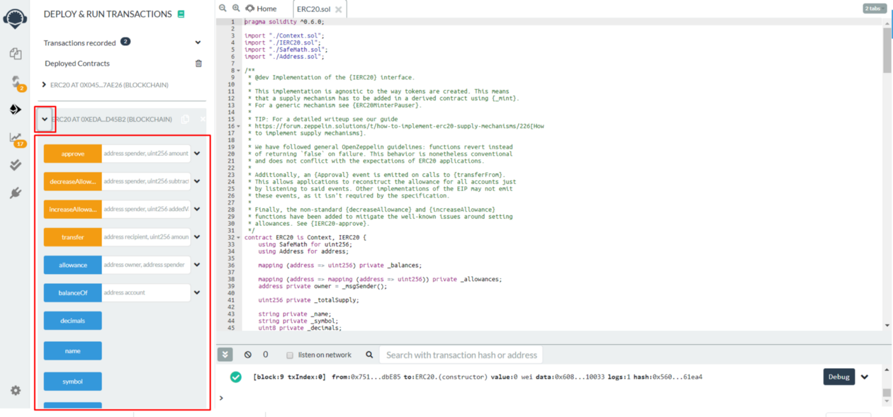

# Desplegar un Smart Contract en Avalanche usando Remix y MetaMask

## Introducción

La Red Primaria de Avalanche es una Subnet que tiene tres cadenas: P-Chain, X-Chain, y C-Chain. La C-Chain es una instancia de la Ethereum Virtual Machine impulsada por el protocolo de consenso Snowman de Avalanche. El [RPC de la C-Chain](../../avalanchego-apis/contract-chain-c-chain-api.md) puede hacer todo lo que un cliente típico de Ethereum puede hacer usando los llamados RPC estándar de Ethereum. Los beneficios inmediatos de usar la C-Chain en vez de Ethereum son todos los beneficios de usar Avalanche. Estas propiedades que podrían mejorar considerablemente el rendimiento de los DApps y la experiencia del usuario.

Hoy, desplegaremos y probaremos un smart contract en Avalanche usando Remix y MetaMask.

## Paso 1: Configurando MetaMask

Iniciamos sesión en MetaMask -&gt; Hacemos click en el menú desplegable Network -&gt; Seleccionamos Custom RPC

#### **Configuración de la Red Principal de Avalanche:**

* **Network Name**: Avalanche Mainnet C-Chain
* **New RPC URL**: [https://api.avax.network/ext/bc/C/rpc](https://api.avax.network/ext/bc/C/rpc)
* **ChainID**: `0xa86a`
* **Symbol**: `AVAX`
* **Explorer**: [https://cchain.explorer.avax.network/](https://cchain.explorer.avax.network/)

#### **FUJI Testnet Settings:**

* **Network Name**: Avalanche FUJI C-Chain
* **New RPC URL**: [https://api.avax-test.network/ext/bc/C/rpc](https://api.avax-test.network/ext/bc/C/rpc)
* **ChainID**: `0xa869`
* **Symbol**: `AVAX`
* **Explorer**: [https://cchain.explorer.avax-test.network](https://cchain.explorer.avax-test.network/)

#### **Local Testnet \(AVASH\) Settings:**

* **Network Name**: Avalanche Local
* **New RPC URL**:[http://localhost:9650/ext/bc/C/rpc](http://localhost:9650/ext/bc/C/rpc)
* **ChainID**: `0xa868`
* **Symbol**: `AVAX`
* **Explorer**: N/A

## Paso 2: Agregando fondos a tu dirección de la C-Chain

### **Usando la Wallet de Avalanche**

En la Red Principal puedes usar la [Wallet de Avalanche](https://wallet.avax.network/) para transferir fondos desde la X-Chain a tu dirección de la C-Chain. El proceso es simple, como se explica en [este tutorial](../platform/transfer-avax-between-x-chain-and-c-chain.md). La Wallet puede ser usada en redes locales y de prueba también.

### **Usando el Faucet de la Red de Pruebas**

Para la agregar fondos en la red de pruebas, también puede utilizar el Faucet de la Red de Pruebas. Ve a [https://faucet.avax-test.network/](https://faucet.avax-test.network/) y pega tu dirección C-AVAX. Todo lo que necesitas hacer es agregar el prefijo “C-” y la Faucet cambiará de AVAX a C-AVAX.

### Agregando Fondos en la Red de Pruebas Local

En una red local, puede agregar fondos fácilmente a sus direcciones desplegando su propio faucet. [Tutorial](https://medium.com/avalabs/the-ava-platform-tools-pt-2-the-ava-faucet-48f28da57146)

## Paso 3: Conectar MetaMask y despliega un smart contract usando Remix

Abre[Remix](https://remix.ethereum.org/) -&gt; Selecciona Solidity

Carga o crea los smart contracts que queremos compilar y desplegar usando el explorador de archivos Remix.

Para este ejemplo, desplegaremos un ERC20 contract de [OpenZeppelin](https://openzeppelin.com/contracts).

Ve a la pestaña Deploy -&gt; Abre el menú desplegable “ENVIRONMENT” y selecciona Injected Web3 \(Asegúrate que MetaMask esté cargado\)

Una vez que se inyectó la web3-&gt; Vuelve al compilador, y compila el contrato seleccionado -&gt; Ve a la pestaña Deploy 

Ahora, que el smart contract está compilado, MetaMask está inyectado, y estamos listos para desplegar nuestro ERC20. hacemos click en “Deploy.”

Confirm the transaction on the MetaMask pop up.

Our contract is successfully deployed!

Now, we can expand it by selecting it from the “Deployed Contracts” tab and test it out.

The contract ABI and Bytecode are available on the compiler tab.

If you had any difficulties following this tutorial or simply want to discuss Avalanche with us, you can join our community at [Discord](https://chat.avalabs.org/)!

<!--stackedit_data:
eyJoaXN0b3J5IjpbODI1ODgxMTE0XX0=
-->