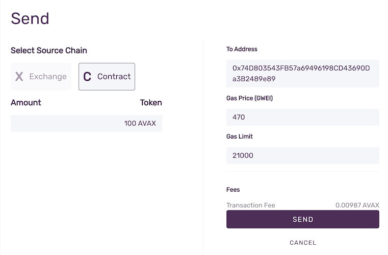
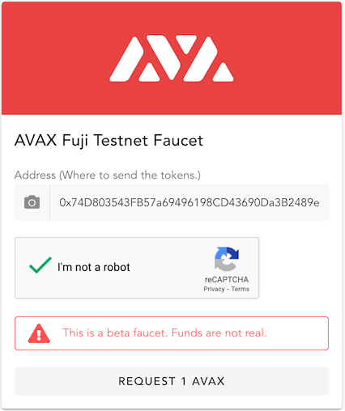
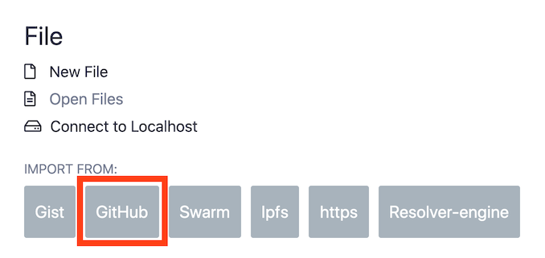

# Usar Wrapped AVAX \(WAVAX\) en Avalanche

## Que es WAVAX?

[AVAX](../../../#avalanche-avax-token) es el token nativo de la  [Plataforma Avalanche ](../../../learn/platform-overview/). Muchos smart contracts en la [Contract Chain \(C-Chain\)](../../../learn/platform-overview/#contract-chain-c-chain), que es una instancia de la Ethereum Virtual Machine, están diseñados para trabajar con Tokens ERC-20 de Ethereum. Para poder usar AVAX en tales contratos, debes usar wrapped AVAX \(WAVAX\), el caul es compatible con ERC-20.

## Descripción

Para convertir AVAX en WAVAX depositarás AVAX en un smart contract que bloqueará los AVAX y te entregará WAVAX. Para convertir WAVAX en AVAX, devolverás los WAVAX al smart contract, que hará burn de los WAVAX y devolverá tu AVAX.

En este tutorial podrás:

* Conectar Metamask a Avalanche
* Agregar fondos a tu cuenta de Metamask
* Cargar el contrato de  WAVAX en Remix
* Conectar con el contrato de WAVAX pre-desplegado
* Convierte AVAX en WAVAX y viceversa
* Añade WAVAX como un token personalizado a Metamask

## Conectar Metamask

[Metamask](https://metamask.io/) es una popular extensión del navegador web que facilita la interacción con el Ethereum y blockchains compatibles, como la C-Chain de Avalanche. Configurar Metamask y crear una cuenta en él está fuera del alcance de este tutorial, pero hay una serie de recursos en Internet para guiarte a través de eso.

Después de entrar en tu cuenta de Metamask, conéctala a la red de Avalanche. Haz clic en el menú desplegable de **Network** -&gt; Selecciona **Custom RPC**:

Introduzca la información de la red de su elección:

### Configuración de la Red Principal de Avalanche:

* **Network Name**: Avalanche Mainnet C-Chain
* **New RPC URL**: [https://api.avax.network/ext/bc/C/rpc](https://api.avax.network/ext/bc/C/rpc)
* **ChainID**: `0xa86a`
* **Symbol**: `AVAX`
* **Explorer**: [https://cchain.explorer.avax.network/](https://cchain.explorer.avax.network/)

### Configuración de la Red de Pruebas Fuji:

* **Network Name**: Avalanche Fuji C-Chain
* **New RPC URL**: [https://api.avax-test.network/ext/bc/C/rpc](https://api.avax-test.network/ext/bc/C/rpc)
* **ChainID**: `0xa869`
* **Symbol**: `AVAX`
* **Explorer**: [https://cchain.explorer.avax-test.network](https://cchain.explorer.avax-test.network/)

Después de guardar los cambios, selecciona la red de Avalanche que acabas de especificar. Deberías ver tu balance de AVAX, que probablemente será 0.

## Agrega Fondos a tu Cuenta de la C-Chain

Necesitas agregar algo de AVAX en tu cuenta.

### **Usando la Wallet de Avalanche**

Si ya tienes algunas AVAX, puedes transferirlas a la cuenta de Metamask usando tu [Wallet de Avalanche](https://wallet.avax.network/). Puedes ver dónde están tus fondos seleccionando **show breakdown** en el panel de la wallet que muestra tu saldo. Si aún no tienes los fondos en la C-Chain necesitas hacer una [Transferencia de Cross Chain](../platform/transfer-avax-between-x-chain-and-c-chain.md), para mover tus AVAX de la X-Chain a la C-Chain.

Después de tener los fondos en la C-Chain, selecciona **Send** en el menú de la izquierda en la Wallet,  y luego cambie la cadena de origen a **C Contract**. En el campo **To Address** pega tu dirección de Metamask. Introduce el monto a enviar y haz click en **Confirm** y ahora en **Send**.

Los fondos pronto estarán visibles en su cuenta de Metamask.

### **Usando el Faucet de la Red de Pruebas**

Si estás conectado a la red de pruebas, puedes usar su faucet para agregar fondos a tu cuenta de Metamask. Ve a [el faucet](https://faucet.avax-test.network/) y pegue su dirección de Ethereum, que se muestra debajo del nombre de la cuenta en Metamask \(Por ejemplo`0xDd1749831fbF70d88AB7bB07ef7CD9c53D054a57`\). Cuando hagas click en el nombre de la cuenta, copiará la cuenta al portapapeles.

Pega esa dirección en el faucet, prueba que no eres un robot, y luego solicita los AVAX de prueba. Deberían aparecer en tu Metamask en breve.

## Load WAVAX contract into Remix

Remix es una popular herramienta basada en un navegador para escribir, desplegar e interactuar con smart contracts. Navegue hasta [Website de Remix](https://remix.ethereum.org/). Desplácese hacia abajo hasta que vea las opciones para importar smart contracts.

Selecciona **GitHub**, y en el campo de entrada pega `https://raw.githubusercontent.com/ava-labs/wrapped-assets/main/WAVAX.sol` y selecciona **OK**. esto cargará el smart contract en Remix.

Cambia a la pestaña del **File Explorer** a la izquierda y selecciona  `WAVAX.sol, que es el contrato que acabamos de cargar.

En el menú de la izquierda, cambia a la pestaña **Compile**:

Check that the compiler version is compatible with the contract, as shown. Press **Compile WAVAX.sol**, and check that WAVAX contract has appeared in the `CONTRACT` field below. Now you're ready to connect to the WAVAX contract, which has already been deployed on the Avalanche network.

## Connect to the WAVAX contract

Switch to the **Deploy & Run Tranasactions** tab on the left side.

Make sure you're logged in to your Metamask. In the **Environment** dropdown menu, select `Injected Web3`. Metamask will pop up and ask you to select the account. Choose the one connected to Avalanche and allow it to connect. This will pre-fill the **Account** field. Make sure the **Contract** field is set to the `WAVAX` contract. Now we can connect to the contract, which has already published on Avalanche. In the **At Address** edit field, copy:

* For Mainnet: `0xB31f66AA3C1e785363F0875A1B74E27b85FD66c7`
* For Fuji Testnet: `0xd00ae08403B9bbb9124bB305C09058E32C39A48c`

After pasting the address, press the **At Address** button.

Remix should find the deployed contract:

We are now ready to interact with the contract. Open the contract interface by pressing the highlighted arrow.

## Issue Commands to the WAVAX Contract

Let's wrap some AVAX!

Since ETH is denominated in 10^18 smaller units \(wei\), and AVAX is denominated in 10^9, switch the value selector from `wei` to `gwei` \(gigawei\). 1 gwei = 10^9 wei = 1 nAVAX.

### Wrap AVAX to Create WAVAX

To wrap 10 AVAX, enter `10000000000` \(10^10\) gwei in the **Value** field. To initiate the wrapping, click **Deposit**. You will be presented with a prompt by Remix to confirm the transaction. When you press **Confirm** Metamask will pop up, also asking for confirmation. Press **Confirm** in Metamask, too. You should notice your AVAX balance lowered by 10, plus the fee amount. Skip to the next section to see your WAVAX in Metamask.

## Add WAVAX to Metamask

To see your WAVAX balance, you must add WAVAX as a custom token to Metamask. In Metamask, select the three dots next to your account name and select `Expand View`. This opens a new browser tab. Scroll down and select **Add token**. Switch to the **Custom Token** tab.

In the **Token Contract Address** paste the same contract address we used before:

* For main net: `0xB31f66AA3C1e785363F0875A1B74E27b85FD66c7`
* For Fuji test net: `0xd00ae08403B9bbb9124bB305C09058E32C39A48c`

Click **Next** and **Add Tokens**. Your WAVAX should now be visible in under your account in Metmask.

### Unwrap WAVAX to AVAX

To unwrap WAVAX, expand the arrow next to **Withdraw** button:

Unfortunately, the withdraw field is denominated in wei, so 10 AVAX is represented as `10000000000000000000` \(10^19\) for the withdraw amount. Pressing **Transact** will trigger the same confirmation first in Remix, then in Metamask. Your AVAX should be back in the account, minus the fee amount.

## Conclusion

You can now interact with smart contracts on Avalanche's C-Chain with WAVAX, the ERC-20 version of AVAX. In the future, converting between AVAX and WAVAX will be significantly simpler, with built-in support from the Wallet and exchanges, but in the meantime, you can still access DEXes, bridges and other Solidity-based contracts on the Avalanche Platform.

<!--stackedit_data:
eyJoaXN0b3J5IjpbLTE3NjY3NzQ4MTEsLTM2OTIzMjk5OCwxMT
c3MjY2OTQ4LDE3MDQ1NTI3NzgsMTY2ODkzNDI0OCwtMTE4MjU3
MzI1MCw2Nzk2NzY3MDksLTE4Njg1NTQxNTldfQ==
-->