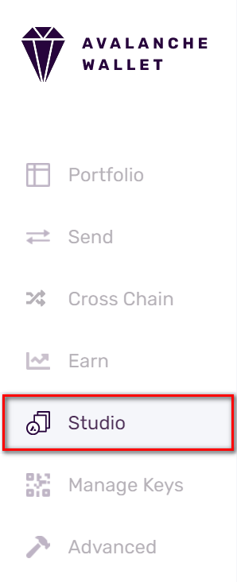
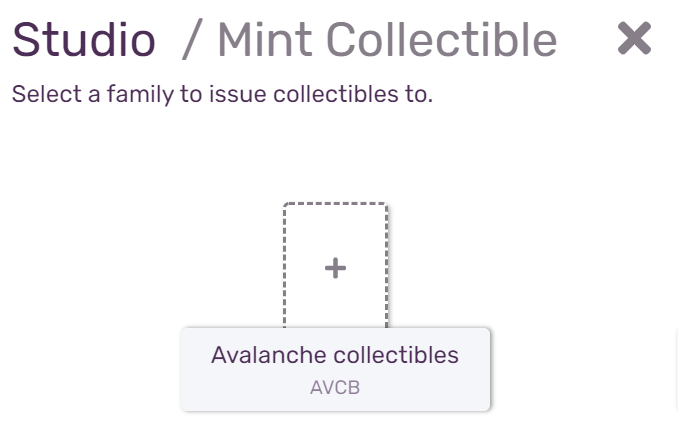
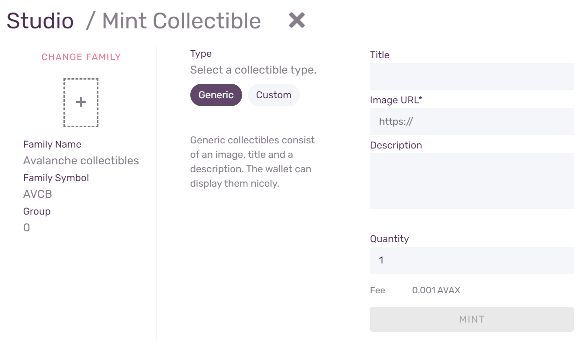
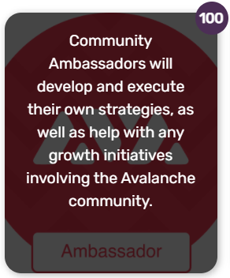
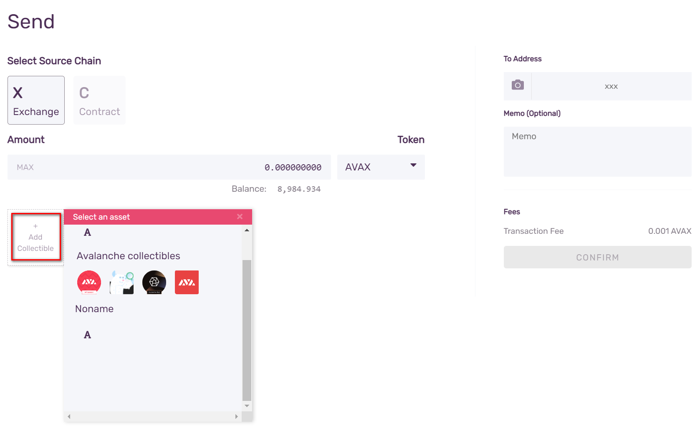
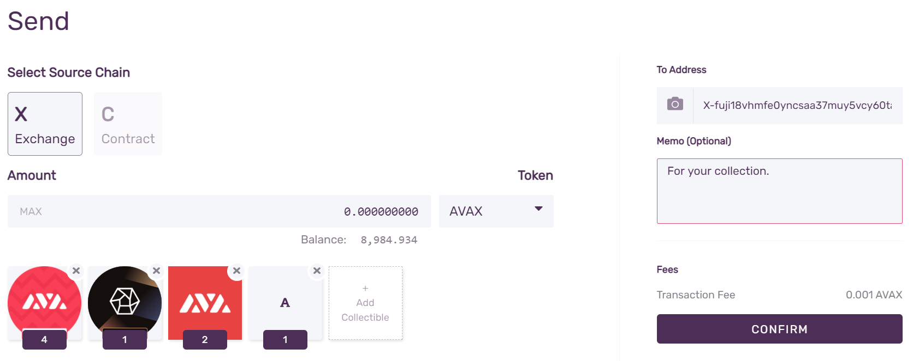
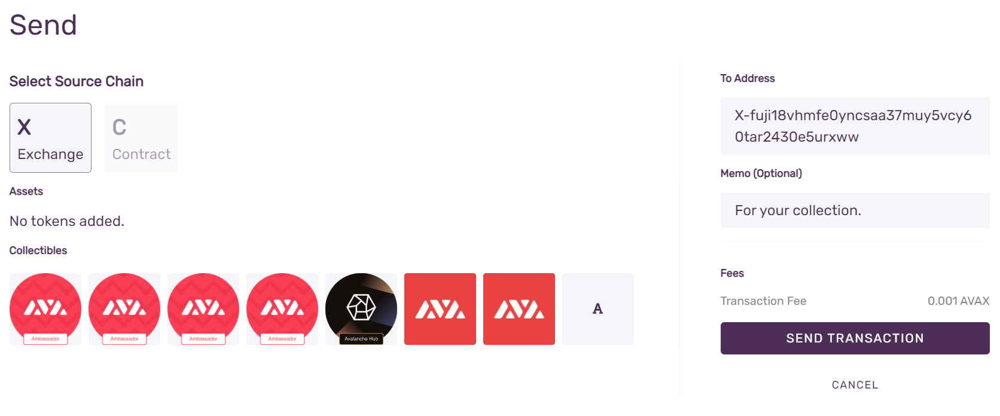

# Acuña NFTs con la Wallet de Avalanche

## Tokens No Fungibles en Avalanche

Además del token nativo de AVAX, [La Plataforma de Avalanche](../platform/) apoya nativamente la creación de otros tipos de activos digitales: activos de capital fijo, activos de capital variable y tokens no fungibles \(NFTs\).

A diferencia de las fichas regulares, que son intercambiables \(fungibles\), lo que significa que cada uno es el mismo, cada token no fungible es único en la red, con un ID distinto que lo hace diferente de cualquier otro. Esto permite muchos casos de uso que serían imposibles con los tokens intercambiables, como la prueba de propiedad de un activo único.

## NFT Studio en la Wallet de Avalanche

Para facilitar la experimentación con la creación e intercambio de NFTs, hemos construido **NFT Studio** en la [Wallet de Avalanche](https://wallet.avax.network/), donde los puedes usar para crear NFTs como activos que llamamos Coleccionables. Los coleccionables pueden ser NFT genéricos con una imagen y una descripción, o NFT personalizados con cargas útiles que contienen JSON, URL personalizado o datos UTF-8. Puedes crearlos usando una simple interfaz de apuntar y hacer clic, lo que te permite la idea de enviar NFTs a tus amigos en cuestión de minutos. Sin que se requieran conocimientos técnicos.

Para acceder al **NFT Studio**, entra en tu Wallet de Avalanche, y en el lado izquierdo selecciona **Studio**:

Esto abrirá  **NFT Studio**. Ahí tienes dos opciones: **New Family**, para la creación de una nueva familia de NFTs, y **Mint Collectible** para la creación de nuevos activos en las familias existentes. Necesitamos crear nuestra primera familia de NFTs, así que haz clic en **New Family**.

### Crear la Familia NFT

Allí se te pedirá que introduzcas el nombre, así como un símbolo \(ticker\). Los nombres no tienen que ser únicos.

Además del nombre y el indicador, tendrás que introducir **Number of Groups**, es decir, cuántos coleccionables distintos tendrá la familia que creaste. Elige con cuidado, porque una vez creada, los parámetros no pueden ser cambiados.

Cuando decidas el nombre, el indicador y el número de grupos, presiona **Create** para crear la familia coleccionable. La comisión por la transacción se deducirá del saldo de su cartera. Cuando se cree la familia, verá el ID de la transacción \(TxID\), así como los parámetros de la familia. Puedes usar el TxID para buscar la transacción en [el explorador](https://explorer.avax.network/), pero no es necesario anotarla.

Presiona **Back to Studio** para volver, y estaremos listos para crear nuestros primeros coleccionables. Presiona **Mint Collectible**.

### Acuñar NFTs

Después de pulsar **Mint Collectible** se le presentará una lista de todas las familias de Coleccionables que aún tienen grupos de Coleccionables que no han sido creados todavía.

Selecciona la familia que acabamos de crear. Te aparecerá un formulario para rellenar con los parámetros del nuevo coleccionable:

Por defecto, se seleccionará un tipo de coleccionable **Generic**. Es un NFT que tiene **Title**, **URL** para la imagen, y **Description**. Introduce los datos necesarios, así como **Quantity**, que determinará cuántas copias del coleccionable se crearán, y por lo tanto, cuántas de ellas podrás enviar. Como antes, introduce los datos con cuidado, no podrás cambiar nada una vez que los coleccionables sean acuñados. Verás una vista previa de los datos donde podrás comprobar cómo se verá tu coleccionable.

Si deseas que tenga otra cosa además de una imagen coleccionable, selecciona **Custom**.

Un coleccionable personalizado puede contener una cadena codificada **UTF-8**, una **URL**, o una carga útil **JSON**. El tamaño de los datos no puede exceder los 1024 caracteres.

Después de introducir y comprobar los datos, pulsa **Mint** para crear el objeto coleccionable. Los gastos de la transacción serán deducidos de tu Wallet, y un coleccionable recién creado aparecerá en tu Wallet.

### Mira Tus Coleccionables

En la parte superior de la pantalla siempre se puede ver un resumen de tus coleccionables, junto con tus saldos.

To see your collectibles in more detail, select **Portfolio** from the left-hand side menu. You will be presented with a screen showing all of your assets, with tokens selected by default. Change the selection to **Collectibles** by clicking the corresponding tab.

For each Generic collectible, a picture will be shown, along with the title, and the number indicating how many copies of the collectible are in your portfolio. Hovering over the collectible with your pointer will show the detailed description:

If you select a collectible by clicking on it, you will see which group it belongs to, its quantity, along with the **Send** button.

## Send NFTs

To send your collectible to someone, either click the **Send** button on the selected collectible in the Portfolio, or navigate to **Send** tab on the left-hand side menu, and click **Add Collectible**:

You will be presented with a menu to select a collectible you wish to send.

You can send multiple collectibles in a single transaction. Clicking the label on the collectible will let you edit the number of copies you wish to send. You can send multiple families and collectible types in a single transaction.

When you have entered the destination address, and optionally entered the memo text, press **Confirm** to initiate the transaction.

After pressing **Send Transaction** it will be published on the network, and the transaction fee will be deducted from your balance. Collectibles will be deposited into the destination address shortly after.

## Summary

Now, you should know how to create NFT families, mint NFT groups, and send them to other addresses. Have fun with it! Make sure to share your creations with us on our [social media channels](https://www.avalabs.org/social)!

If you would like to know the technical background of how NFTs work on the Avalanche network or would like to build products using NFTs, please check out the [NFT tutorial](creating-a-nft-part-1.md). If you have technical questions, reach out to us on our [Discord](https://chat.avalabs.org/) server.

<!--stackedit_data:
eyJoaXN0b3J5IjpbMzkxNzI5ODYzLDExMDYxNTg3OTgsMTIwOT
MyMjUyNV19
-->