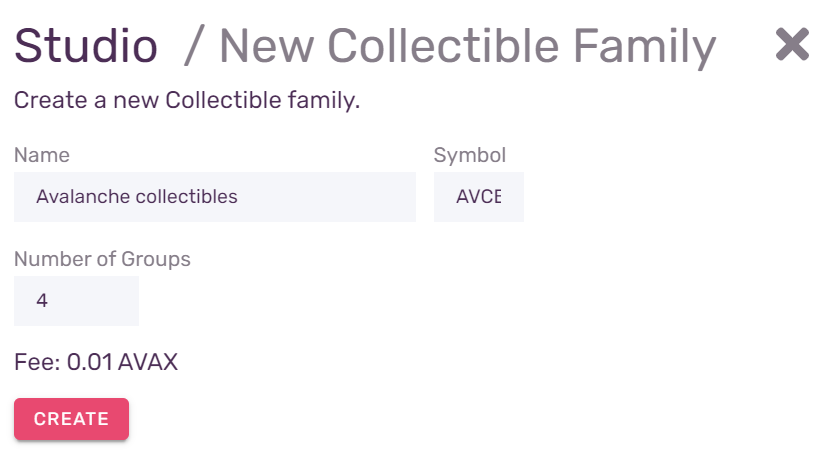
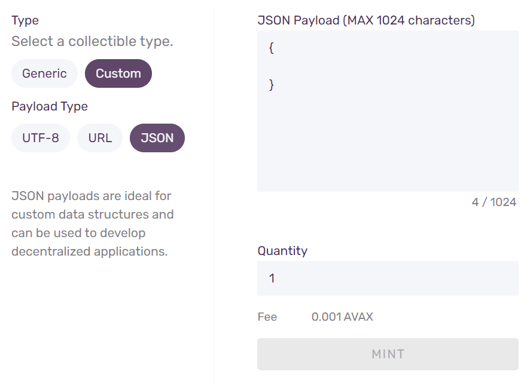
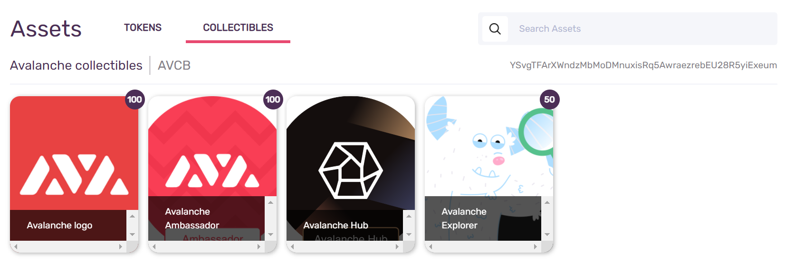

# Acuña NFTs con la Wallet de Avalanche

## Tokens No Fungibles en Avalanche

Además del token nativo de AVAX, [La Plataforma de Avalanche](../platform/) apoya nativamente la creación de otros tipos de activos digitales: activos de capital fijo, activos de capital variable y tokens no fungibles \(NFTs\).

A diferencia de los tokens regulares, que son intercambiables \(fungibles\), lo que significa que cada uno es el mismo, cada token no fungible es único en la red, con un ID distinto que lo hace diferente de cualquier otro. Esto permite muchos casos de uso que serían imposibles con los tokens intercambiables, como la prueba de propiedad de un activo único.

## NFT Studio en la Wallet de Avalanche

Para facilitar la experimentación con la creación e intercambio de NFTs, hemos construido **NFT Studio** en la [Wallet de Avalanche](https://wallet.avax.network/), donde los puedes usar para crear NFTs como activos que llamamos Coleccionables. Los coleccionables pueden ser NFT genéricos con una imagen y una descripción, o NFT personalizados con cargas útiles que contienen JSON, URL personalizado o datos UTF-8. Puedes crearlos usando una simple interfaz de apuntar y hacer clic, lo que te permite la idea de enviar NFTs a tus amigos en cuestión de minutos. Sin que se requieran conocimientos técnicos.

Para acceder al **NFT Studio**, entra en tu Wallet de Avalanche, y en el lado izquierdo selecciona **Studio**:

Esto abrirá **NFT Studio**. Ahí tienes dos opciones: **New Family**, para la creación de una nueva familia de NFTs, y **Mint Collectible** para la creación de nuevos activos en las familias existentes. Necesitamos crear nuestra primera familia de NFTs, así que haz clic en **New Family**.

### Crear la Familia NFT

Allí se te pedirá que introduzcas el nombre, así como un símbolo \(ticker\). Los nombres no tienen que ser únicos.

Además del nombre y el indicador, tendrás que introducir **Number of Groups**, es decir, cuántos coleccionables distintos tendrá la familia que creaste. Elige con cuidado, porque una vez creada, los parámetros no pueden ser cambiados.

Cuando decidas el nombre, el indicador y el número de grupos, presiona **Create** para crear la familia coleccionable. La comisión por la transacción se deducirá del saldo de su wallet. Cuando se cree la familia, verás el ID de la transacción \(TxID\), así como los parámetros de la familia. Puedes usar el TxID para buscar la transacción en [el explorador](https://explorer.avax.network/), pero no es necesario anotarla.

Presiona **Back to Studio** para volver, y estaremos listos para crear nuestros primeros coleccionables. Presiona **Mint Collectible**.

### Acuñar NFTs

Después de pulsar **Mint Collectible** se te presentará una lista de todas las familias de Coleccionables que aún tienen grupos de Coleccionables que no han sido creados todavía.

Selecciona la familia que acabamos de crear. Te aparecerá un formulario para rellenar con los parámetros del nuevo coleccionable:

Por defecto, se seleccionará un tipo de coleccionable **Generic**. Es un NFT que tiene **Title**, **URL** para la imagen, y **Description**. Introduce los datos necesarios, así como **Quantity**, que determinará cuántas copias del coleccionable se crearán, y por lo tanto, cuántas de ellas podrás enviar. Como antes, introduce los datos con cuidado, no podrás cambiar nada una vez que los coleccionables sean acuñados. Verás una vista previa de los datos donde podrás comprobar cómo se verá tu coleccionable.

Si deseas que tenga otra cosa además de una imagen coleccionable, selecciona **Custom**.

Un coleccionable personalizado puede contener una cadena codificada **UTF-8**, una **URL**, o una carga útil **JSON**. El tamaño de los datos no puede exceder los 1024 caracteres.

Después de introducir y comprobar los datos, pulsa **Mint** para crear el objeto coleccionable. Los gastos de la transacción serán deducidos de tu Wallet, y un coleccionable recién creado aparecerá en tu Wallet.

### Mira Tus Coleccionables

En la parte superior de la pantalla siempre se puede ver un resumen de tus coleccionables, junto con tus saldos.

Para ver tus coleccionables con más detalle, selecciona **Portfolio** en el menú de la izquierda. Te aparecerá una pantalla que muestra todos tus bienes, con tokens seleccionados por defecto. Cambia la selección a **Collectibles** haciendo clic en la pestaña correspondiente.

Para cada coleccionable genérico, se mostrará una imagen, junto con el título, y el número que indica cuántas copias del coleccionable hay en tu wallet. Colocando el puntero sobre el coleccionable se mostrará la descripción detallada:

Si selecciona un objeto de colección haciendo clic en él, verá a qué grupo pertenece y su cantidad, junto al botón **Send**.

## Enviar NFTs

Para enviar tu coleccionable a alguien, haz clic en el botón **Send** en el coleccionable seleccionado en el Portafolio, o ve a la pestaña **Send** en el menú de la izquierda, y haz clic en **Add Collectible**:

Se te presentará un menú para seleccionar un coleccionable que desees enviar.

Puedes enviar varios coleccionables en una sola transacción. Al hacer clic en la etiqueta del coleccionable, podrás editar el número de copias que deseas enviar. Puedes enviar varias familias y tipos de coleccionables en una sola transacción.

Cuando hayas introducido la dirección de destino y, opcionalmente, el texto del **memo**, pulsa **Confirm** para iniciar la transacción.

Después de pulsar **Send Transaction** la transacción se publicará en la red, y la comisión de la transacción se deducirá de tu saldo. Los coleccionables serán depositados en la dirección de destino casi inmediatamente.

## Resumen

Ahora, debes saber cómo crear familias de NFT, acuñar grupos de NFT, y enviarlos a otras direcciones. ¡Diviértete con ello! Asegúrate de compartir tus creaciones con nosotros en nuestros [canales de medios sociales](https://www.avalabs.org/social)!

Si desesa conocer los antecedentes técnicos de cómo funcionan los NFT en la red de Avalanche o deseas construir productos usando NFT, mira el [Tutorial de NFT](creating-a-nft-part-1.md). Si tienes preguntas técnicas, ponte en contacto con nosotros en nuestro [Servidor de Discord](https://chat.avalabs.org/).

